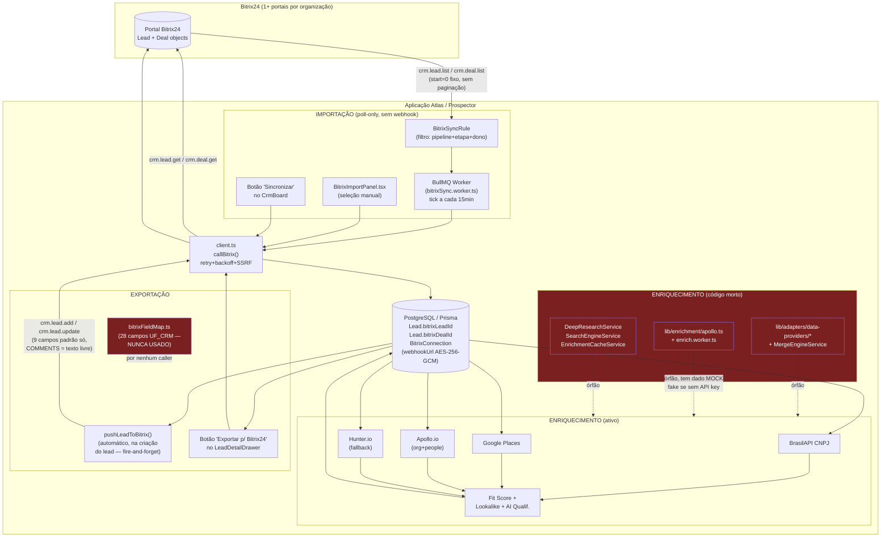
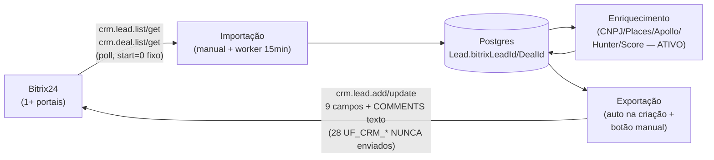

# Auditoria End-to-End: Fluxo Bitrix24 + Importação/Exportação + Enriquecimento de Leads

**Data:** 2026-08-09
**Método:** leitura direta do código executável (não documentação), 4 frentes de pesquisa paralelas + verificação manual + execução de testes unitários reais. Toda afirmação abaixo tem evidência em `arquivo:linha`.

---

## 1. Resumo executivo

A aplicação tem uma integração Bitrix24 real e **parcialmente funcional**, não decorativa. A camada mais crítica tecnicamente — o cliente REST (`client.ts`) com retry/backoff/SSRF — é sólida e coberta por 17 testes automatizados que passam. Mas o fluxo completo "lead entra → é enriquecido → volta pro Bitrix com dados ricos" está **quebrado em dois pontos estruturais**:

1. **O mapa de 28 campos customizados (`UF_CRM_*`) construído para o Bitrix nunca é usado.** `bitrixFieldMap.ts` existe, está completo e documentado, mas nenhuma função de import ou export do código real o importa. `crm.lead.add`/`crm.lead.update` só enviam 9 campos padrão (nome, telefone, e-mail, empresa, comentário). Toda a inteligência comercial (qualificação, cadência, motivo de perda, % comissão etc.) fica presa no Atlas.
2. **A maior parte do pipeline de enriquecimento avançado (CNPJ via adapters dedicados, Apollo via `lib/enrichment/apollo.ts`, DeepResearch, SearchEngine, cache) é código morto** — implementado, testado isoladamente, nunca chamado em produção. O que *está* ativo (CNPJ via BrasilAPI, Google Places, Apollo via `prospecting.service.ts`, Hunter, scoring) funciona, mas seus resultados chegam ao Bitrix apenas como texto solto dentro do campo `COMMENTS`, nunca como dados estruturados.

A importação automática (sync rules, a cada 15 min) tem uma lacuna de paginação real: sempre lê a página 0 do Bitrix e nunca segue o cursor `next`. A exportação (push automático + botão manual) funciona e tem tratamento de erro correto nas ações manuais, mas o push automático falha silenciosamente sem qualquer sinal visível ao operador — reconhecido no próprio código-fonte como lacuna conhecida.

---

## 2. Arquitetura real (não a teórica)



**Não existe webhook de entrada** (`ONCRMLEADADD`/`ONCRMLEADUPDATE`) — confirmado por ausência total de rota não-autenticada equivalente às que existem para 3CX e Birth Voice (`server.ts:219-220`). Bitrix → Atlas é **exclusivamente pull** (poll a cada 15 min ou clique manual). Isso elimina o risco clássico de loop de webhook por construção — não porque haja uma guarda, mas porque a metade que fecharia o ciclo simplesmente não existe.

---

## 3. Inventário de arquivos

| Arquivo | Função | Relação c/ Bitrix | Importa | Exporta | Enriquece |
|---|---|---|---|---|---|
| `src/features/integrations/bitrix/service/client.ts` | Cliente REST (fetch, retry, backoff, SSRF guard) | Núcleo — todas as chamadas passam aqui | — | — | — |
| `src/features/integrations/bitrix/service/leads.ts` | `crm.lead.list/get`, `importSelectedBitrixLeads` | Import de Leads | ✅ | — | — |
| `src/features/integrations/bitrix/service/deals.ts` | `crm.deal.list/get`, `crm.contact.get`, `crm.company.get`, import de Deals | Import de Deals | ✅ | — | — |
| `src/features/integrations/bitrix/service/connections.ts` | CRUD de `BitrixConnection` (múltiplos portais/org) | Gestão de conexões | — | — | — |
| `src/features/integrations/bitrix/service/syncRules.ts` | `BitrixSyncRule`, `runSyncRule`, `runBitrixSyncTick` | Import automático (15 min) | ✅ | — | — |
| `src/features/integrations/bitrix/service/outboundSync.ts` | `syncLeadToBitrix`, `pushLeadToBitrix`, `exportLeadToBitrixNow` | Export (`crm.lead.add/update`) | — | ✅ | — |
| `src/features/integrations/bitrix/bitrix.service.ts` | Barrel de re-export (não tem lógica própria) | — | — | — | — |
| `src/features/integrations/bitrix/bitrixFieldMap.ts` | Mapa de 28 campos `UF_CRM_*` | **Definido, nunca usado** | ❌ | ❌ | — |
| `src/features/integrations/bitrix/bitrix.routes.ts` | Rotas Express `/api/bitrix/*` | Camada HTTP | ✅ | ✅ | — |
| `src/lib/adapters/crm/Bitrix24Adapter.ts` | `assertSafeWebhookUrl` (guarda SSRF) | Segurança | — | — | — |
| `src/lib/queue/bitrixSync.worker.ts` | Worker BullMQ, tick a cada 15 min | Dispara import automático | ✅ (dispara) | — | — |
| `src/features/crm/routes/lead.routes.ts` | Rotas `/api/leads/export/bitrix24`, `/import/bitrix24`, `/:id/enrich` | Camada HTTP | ✅ | ✅ | ✅ |
| `src/features/crm/presentation/LeadController.ts` | Handlers dos endpoints acima | — | ✅ | ✅ | ✅ |
| `src/features/crm/application/LeadUseCases.ts` | `importRecentBitrixLeads`, `exportLeadToBitrix`, `enrichLead` | Orquestração | ✅ | ✅ | ✅ |
| `src/features/crm/infra/PrismaLeadRepository.ts` | CRUD de `Lead` via Prisma | **Não expõe campos Bitrix** | — | — | — |
| `src/features/crm/domain/Lead.ts` | Interface de domínio `Lead` | **Não declara `bitrixLeadId`/`bitrixDealId`** | — | — | — |
| `src/hooks/useBitrixIntegration.ts` | Hook React — connect/disconnect | UI state | — | — | — |
| `src/features/integrations/components/BitrixImportPanel.tsx` | UI de importação manual seletiva | ✅ | ✅ | — | — |
| `src/features/integrations/components/BitrixSyncRulesPanel.tsx` | UI de regras de sync automático | ✅ | — | — | — |
| `src/features/integrations/components/Integrations.tsx` | Painel de conexões | ✅ | — | — | — |
| `src/components/CrmBoard.tsx` | Kanban — botão "Sincronizar Bitrix24", enriquecer | ✅ | ✅ | — | ✅ |
| `src/features/crm/components/LeadDetailDrawer.tsx` | Drawer de detalhe — botão "Exportar p/ Bitrix24", "Enriquecer" | — | ✅ | ✅ | ✅ |
| `src/features/prospecting/services/prospecting.service.ts` | `promoteToCrm` (cria lead, chama `pushLeadToBitrix`) | Dispara export automático | — | ✅ (dispara) | ✅ |
| `src/features/prospecting/services/enrichment.service.ts` | `runEnrichment` — orquestra CNPJ/Places/Apollo/Hunter/score | — | — | — | ✅ Núcleo ativo |
| `src/lib/adapters/data-providers/*`, `MergeEngineService.ts` | Adapters redundantes de enriquecimento | — | — | — | ❌ Órfão |
| `src/lib/enrichment/apollo.ts`, `src/lib/queue/enrich.worker.ts` | Segunda integração Apollo (com fallback MOCK) | — | — | — | ❌ Órfão |
| `prisma/schema.prisma` | Modelos `BitrixConnection`, `BitrixSyncRule`, `Lead.bitrixLeadId/bitrixDealId/bitrixStageLabel` | Persistência | — | — | — |
| `src/lib/crypto/secretFields.ts` | Criptografia AES-256-GCM de `webhookUrl` | Segurança de credenciais | — | — | — |

---

## 4. Fluxo de importação (Bitrix → Atlas)

### 4.1 Endpoints usados
- `crm.lead.list` (`leads.ts:79-84`) — `select: ['ID','TITLE','NAME','LAST_NAME','COMPANY_TITLE','PHONE','EMAIL','STATUS_ID','SOURCE_ID','DATE_CREATE']`, `order: {DATE_CREATE:'DESC'}`.
- `crm.lead.get` (`leads.ts:128`) — um por vez, dentro de `for`.
- `crm.deal.list`/`crm.deal.get` + `crm.contact.get`/`crm.company.get` (`deals.ts`) — mesmo padrão, um a um.
- **`batch` (Bitrix batch API): NÃO ENCONTRADO.** Toda importação de N registros é N chamadas HTTP sequenciais.

### 4.2 Quando ocorre
1. **Manual seletivo** — `BitrixImportPanel.tsx` → `POST /api/bitrix/leads/import` ou `/deals/import`.
2. **Botão rápido** — `CrmBoard.tsx:338-352` → `POST /api/leads/import/bitrix24` → `LeadUseCases.importRecentBitrixLeads` (`LeadUseCases.ts:205-231`), que escolhe **a primeira conexão** da organização automaticamente e importa até 25 leads não importados.
3. **Automático recorrente** — `BitrixSyncRule` + worker BullMQ real (Redis), tick a cada 15 min (`bitrixSync.worker.ts`), só ativo se `REDIS_URL`/`ENABLE_QUEUES` estiverem configurados (`redis.ts:5-6`); sem Redis, **o worker simplesmente nunca roda** (sem fallback de polling).

### 4.3 Quais leads são importados — filtro exato
`BitrixSyncRuleInput` (`syncRules.ts:17-25`): `source` (`lead`|`deal`), `categoryId` (pipeline, obrigatório p/ deal), `stageId` (etapa/status, opcional), `assignedById` (dono, opcional). **Não filtra por data/período** — cada tick relê a mesma página 0 e descarta o que já foi importado via `bitrixLeadId`/`bitrixDealId`.

---

## 5. Campos importados

| Campo Bitrix | Campo interno | Tipo | Obrigatório | Transformação |
|---|---|---|---|---|
| `ID` | `Lead.bitrixLeadId` / `Lead.bitrixDealId` | string | sim | `String(id)` |
| `TITLE` | usado só como fallback de nome de empresa | string | não | — |
| `NAME`/`LAST_NAME` | `Contact.name` | string | não | concatenação |
| `COMPANY_TITLE` | `Company.legalName`/`tradeName` | string | não | — |
| `PHONE`/`EMAIL` | `Contact.phone`/`email` | array Bitrix → string | não | pega primeiro item |
| `STATUS_ID` | `Lead.bitrixStageLabel` (texto bruto, **não** mapeado pro enum `LeadStatus` interno) | string | não | — |
| `SOURCE_ID` | não lido no import | — | — | ignorado |
| `ASSIGNED_BY_ID` | usado só para filtro de sync rule, não persistido no Lead | — | — | — |
| `DATE_CREATE`/`DATE_MODIFY` | não persistido | — | — | ignorado |
| `COMMENTS` | não lido no import | — | — | ignorado |
| `UTM_*` | **não lido em nenhum lugar** | — | — | ignorado |
| **`UF_CRM_*` (28 campos mapeados em `bitrixFieldMap.ts`)** | **NENHUM é lido pelo import** — `select` de `crm.lead.list` não os inclui | — | — | **PERDA DE DADO** |

**Achado crítico:** o `select` de `listBitrixLeads` (`leads.ts:81`) e a interface `BitrixLeadRaw` (`leads.ts:18-30`) nunca solicitam nenhum `UF_CRM_*`. Toda a qualificação comercial cadastrada em Bitrix (segmento de operação, tipo de carga, frota, ERP/TMS, dor mapeada, nível de autoridade etc.) **nunca entra no Atlas** via importação, apesar de existir um mapa completo desses 28 campos no repositório.

---

## 6. Paginação — resposta direta

> **Se existirem 5.000 leads no Bitrix24, o sistema consegue importar todos?**

**Depende do caminho:**
- **Import manual via `BitrixImportPanel.tsx`**: a rota aceita `start` como query param (`bitrix.routes.ts:88,179`) e a função devolve `next` ao chamador — a UI *pode* paginar clicando novamente, mas isso depende de o componente de fato usar o `next` retornado (não confirmado como "carregar mais" explícito nesta auditoria; a arquitetura permite, mas o `start=0` é o padrão de toda nova consulta).
- **Import automático via `BitrixSyncRule` (`runSyncRule`, `syncRules.ts:76-84` e `87-96`): CRÍTICO — sempre chama com `start=0` fixo, nunca segue o cursor `next` do Bitrix.** Bitrix pagina por padrão em blocos de 50. Se uma regra tem >50 leads correspondentes ao filtro e os primeiros 50 já foram todos importados em ticks anteriores, os registros além da página 0 **nunca são alcançados por essa regra**, indefinidamente — cada tick de 15 min relê a mesma primeira página, encontra tudo já importado (`skipped`), e termina. Isso é agravado pelo teto de `MAX_AUTO_IMPORT_PER_RULE_PER_TICK = 25` (`syncRules.ts:68`), que é irrelevante frente ao problema real: a paginação nunca avança.

**Resposta: NÃO, não com o worker automático.** Com 5.000 leads batendo no filtro de uma regra, apenas os primeiros ~50 (uma página) são visíveis ao sync automático — os demais ficam permanentemente fora do alcance dele, sem qualquer erro visível (o tick "termina com sucesso", só que sem nada a fazer). O caminho manual pode, em teoria, paginar clicando repetidamente, mas isso não foi confirmado como fluxo de "carregar mais" implementado na UI dentro do escopo lido.

---

## 7. Rate limit do Bitrix24

Esta é a parte mais bem construída da integração — testada e correta:

- HTTP 429 → `TransientBitrixError`, com `Retry-After` respeitado (`client.ts:44-50,151-152`).
- `QUERY_LIMIT_EXCEEDED` no corpo (200 OK mas erro "soft") → também tratado como transiente (`client.ts:170-172`).
- Backoff exponencial com jitter: `BASE_BACKOFF_MS=500`, `MAX_BACKOFF_MS=8000`, até `BITRIX_MAX_ATTEMPTS=4` tentativas (`client.ts:21-38`).
- 401/403 → erro definitivo, **nunca** reintentado (`client.ts:157-159`).
- Timeout de 15s por tentativa via `AbortController` (`client.ts:24,131-144`).
- Confirmado por 17 testes reais executados nesta auditoria (`client.test.ts`, todos passando) cobrindo: sucesso direto, recuperação em 5xx, recuperação em 429, recuperação em `QUERY_LIMIT_EXCEEDED`, esgotamento de tentativas → `AppError` sanitizado, não-retry em 401/403, não-retry em erro definitivo, `AbortError` tratado como transiente, falha de rede tratada como transiente, correlationId estável, e rejeição SSRF pré-fetch.

**Nível worker/job (BullMQ): sem retry.** `scheduleBitrixSync` usa `attempts: 1` (`bitrixSync.worker.ts`) — se `runBitrixSyncTick` falhar no nível do job (não no nível de uma chamada HTTP individual, que já tem retry próprio), o job falha e só é logado (`worker.on('failed', ...)`), sem re-tentativa nem dead-letter queue. Isso é aceitável porque a resiliência real já está dentro de `callBitrix`; o gap é apenas cosmético (sem alerta agregado de "worker falhou").

---

## 8. Duplicidade

**Import (Bitrix → Atlas):** checagem `findFirst({organizationId, bitrixLeadId})` antes de criar (`leads.ts:121-126`), mesmo padrão para `bitrixDealId` em `deals.ts:205-209`. **Check-then-create sem constraint única no banco** (`prisma/schema.prisma:293-295` documenta essa decisão deliberadamente — "não é `@unique` hard"). Duas requisições concorrentes (ex.: clique manual + tick do worker rodando ao mesmo tempo) podem passar ambas pelo `findFirst` antes de qualquer `create`, gerando Lead duplicado. Mitigado na UI por desabilitar botões durante a chamada, mas não protegido contra concorrência real entre superfícies diferentes (painel manual vs. worker automático).

**Export (Atlas → Bitrix):** decidido apenas por `lead.bitrixLeadId` estar setado ou não (ver seção 9). **Não há nenhuma checagem por e-mail/telefone contra registros já existentes no Bitrix** — se `bitrixLeadId` for nulo por qualquer motivo (falha anterior na gravação do ID, lead criado direto no Bitrix por outra via), o sistema sempre cria (`crm.lead.add`) em vez de tentar casar com um lead humano-criado equivalente.

**Lead-path vs. Deal-path:** um mesmo registro real importado uma vez como Lead (`bitrixLeadId` setado) e depois também como Deal (`bitrixDealId` setado) **não é detectado como duplicata cruzada** — são namespaces de ID diferentes e não há checagem de e-mail/telefone/CNPJ entre os dois caminhos.

---

## 9. Fluxo de exportação (Atlas → Bitrix)

### 9.1 Quando ocorre — gatilhos reais
1. **Automático, sempre, sem clique** — `pushLeadToBitrix` (`outboundSync.ts:79-89`), disparado dentro de `promoteToCrm` (`prospecting.service.ts:402`, `void pushLeadToBitrix(...)`) toda vez que um lead novo é criado no Atlas. Fire-and-forget: a criação do lead nunca espera nem falha por causa disso.
2. **Manual** — botão "Exportar p/ Bitrix24" no `LeadDetailDrawer.tsx:546-554` → `POST /api/leads/export/bitrix24` → `exportLeadToBitrixNow`.
3. **Manual em lote** — a mesma função aceita `leadId === 'all'` para exportar todos os leads da organização de uma vez (`outboundSync.ts:106-130`), embora não tenha sido localizado um botão de UI específico para esse modo "todos" nas telas lidas — pode ser um caminho de API não exposto na UI atual.

Não existe gatilho por "após enriquecimento", "após aprovação humana", "quando muda de status", "quando IA classifica" ou "quando cadência começa" — **o único gatilho automático é a criação do lead**, uma única vez.

### 9.2 Cria ou atualiza — lógica exata
```ts
// outboundSync.ts:49-55
if (lead.bitrixLeadId) {
    await callBitrix(webhookUrl, 'crm.lead.update', { id: lead.bitrixLeadId, fields });
    return { bitrixLeadId: lead.bitrixLeadId };
}
const { result: newId } = await callBitrix(webhookUrl, 'crm.lead.add', { fields });
await prisma.lead.update({ where: { id: lead.id }, data: { bitrixLeadId: String(newId) } });
```
Simples e correto no caso feliz: primeira vez cria e grava o ID; toda vez seguinte atualiza. O risco é apenas o cenário de concorrência descrito na seção 8.

---

## 10. Campos exportados

| Campo interno | Campo Bitrix | Regra | Origem |
|---|---|---|---|
| `company.tradeName`/`legalName` | `TITLE` | fallback em cadeia, senão `'Lead Atlas'` | `outboundSync.ts:38` |
| `contact.name` (primeiro nome) | `NAME` | split por espaço | `outboundSync.ts:39` |
| `contact.name` (resto) | `LAST_NAME` | split por espaço | `outboundSync.ts:40` |
| `company.legalName`/`tradeName` | `COMPANY_TITLE` | fallback em cadeia | `outboundSync.ts:41` |
| `contact.phone` | `PHONE` | array `[{VALUE, VALUE_TYPE:'WORK'}]` | `outboundSync.ts:42-43` |
| `contact.email` | `EMAIL` | array `[{VALUE, VALUE_TYPE:'WORK'}]` | `outboundSync.ts:44-45` |
| — | `SOURCE_ID` | hardcoded `'WEB'` | `outboundSync.ts:46` |
| — | `SOURCE_DESCRIPTION` | hardcoded `'AtlasGR Prospector'` | `outboundSync.ts:46` |
| status/etapa Atlas + score + temperatura + resumo enriquecimento | `COMMENTS` | **texto livre concatenado**, único lugar onde qualquer dado de enriquecimento aparece | `outboundSync.ts:28-35,46` |

**Não exportados, apesar de existirem no Atlas:** CNPJ, LinkedIn, tecnologias/keywords (Apollo), Google rating/reviews, employee count, endereço/cidade/estado estruturados, ICP/fit score numérico, lookalike score, nenhum dos 28 campos `UF_CRM_*` (segmento, tipo de carga, frota, ERP/TMS, dor mapeada, motivo de perda, % comissão, parceiro/corretor, nível de relacionamento, pacote, status do negócio, data de retomada, etapa de cadência), `STATUS_ID`, `CATEGORY_ID`/pipeline, `ASSIGNED_BY_ID`. Tudo isso é **PERDA DE DADO** na direção Atlas → Bitrix — os dados existem no banco local mas nunca cruzam a fronteira.

---

## 11. Enriquecimento de leads

### 11.1 Motores — matriz completa

| Motor | Implementado | Chamado (real) | Credencial | Resultado salvo | Enviado ao Bitrix |
|---|---|---|---|---|---|
| BrasilAPI CNPJ | ✅ | ✅ ativo | nenhuma (público) | `Company.*` (razão social, CNAE, capital social, endereço, sócios etc.) | ⚠️ só como texto em `COMMENTS` |
| Google Places (New) | ✅ | ✅ ativo (modo `hybrid`) | `GOOGLE_MAPS_API_KEY` | `Company.googleRating/reviewsCount/businessHours/website` | ❌ nunca |
| Apollo.io (org + people) | ✅ | ✅ ativo (modo `hybrid`) | `APOLLO_API_KEY` | `Company.*`, `Contact.*` (decisores) | ⚠️ só `Contact.role`→`Cargo` mapeado; resto não |
| Hunter.io | ✅ | ✅ ativo (fallback do Apollo quando 403) | `HUNTER_API_KEY` | `Contact.*` | ⚠️ igual acima |
| GDELT News | ✅ | ✅ ativo | nenhuma | `Company.newsMentions` | ❌ nunca |
| DuckDuckGo CNPJ-by-name (scrape) | ✅ | ✅ ativo (fallback) | nenhuma | alimenta lookup CNPJ | N/A |
| Domain guess + verificação MX | ✅ | ✅ ativo | nenhuma | `Company.website/emails` | ❌ nunca |
| Lookalike scoring (pgvector) | ✅ | ✅ ativo (cold-start nulo <3 exemplos) | credencial AI gateway | `Company.lookalikeScore` | ❌ nunca |
| Icebreaker (Playwright + LLM local) | ✅ | ✅ ativo | credencial AI gateway; Playwright opcional | texto em `Company.observations` | ❌ nunca |
| Fit Score determinístico | ✅ | ✅ ativo | nenhuma | `Lead.score`, `Lead.temperature` | ⚠️ só texto em `COMMENTS` |
| Qualificação IA (LangGraph) | ✅ | ✅ ativo via `/api/intelligence/qualify` | credencial AI gateway | `Lead.score/temperature/timeline` | ⚠️ igual acima |
| **`lib/adapters/data-providers/*` + `MergeEngineService`** | ✅ completo, testado isoladamente | ❌ **ÓRFÃO** — só importado pelo próprio teste unitário | — | nunca roda em produção | — |
| **`lib/enrichment/apollo.ts` + `enrich.worker.ts`** | ✅ completo, **com fallback de dado MOCK/fake** | ❌ **ÓRFÃO** — worker nunca é instanciado em `server.ts`, fila nunca recebe job | `APOLLO_API_KEY` | nunca roda | — |
| `DeepResearchService`, `SearchEngineService`, `EnrichmentCacheService` | ✅ classes completas | ❌ **ÓRFÃO** — nunca instanciadas | — | nunca roda | — |

### 11.2 Pipeline real (o que de fato acontece)

```
Lead/Company criado (promoteToCrm)
  → runEnrichment() [enrichment.service.ts]
      → CNPJ (BrasilAPI, com fallback de descoberta via DuckDuckGo scrape)
      → Domain guess + verificação de e-mail (MX)
      → Google Places (se modo hybrid) → rating/reviews/horário
      → Apollo (org + decisores) → tecnologias, contatos, cargo
      → Hunter (fallback se Apollo 403 por plano)
      → GDELT News → menções recentes
      → Lookalike score (pgvector, precisa ≥3 negócios ganhos com embedding)
      → Icebreaker (scrape + LLM local)
      → Fit Score (determinístico) → Lead.score/temperature
  → tudo persistido em Company.*/Contact.*/Lead.score
  → pushLeadToBitrix() [fire-and-forget, catch silencioso]
      → só 9 campos padrão + resumo em texto livre no COMMENTS
```

O pipeline **funciona e é chamado de verdade** nos 3 pontos de entrada reais (criação de empresa via fila, promoção lead→CRM, botão manual "Enriquecer"). O problema não é "o enriquecimento não roda" — é que **o resultado rico nunca sai da tabela `Company`/`Contact` em direção ao Bitrix estruturado**.

### 11.3 Erros silenciosos no enriquecimento
- `places.service.ts:80-83` → `catch { return null }`
- `news.service.ts:69-72` → `catch { return [] }`
- `cnpj.util.ts:54-56` → `catch { return null }`
- `IcebreakerService.ts:85-90` → `catch { return '' }`
- `promoteToCrm` (`prospecting.service.ts:369-373`) — se `enrichCompany` lançar, o erro é logado e **o lead é criado com sucesso mesmo assim** (HTTP 201), sem fit score, sem qualquer sinal ao usuário de que o enriquecimento falhou.
- Contraponto correto: `enrichCompany` (`enrichment.service.ts:100-105`) grava `Company.enrichmentStatus='Falhou'` explicitamente — existe estado de falha persistido, só não é propagado para a resposta HTTP de criação do lead.

Retry: encontrado **apenas** no CNPJ lookup (`cnpjLookup.ts:75-97`, 2 tentativas, só em `status>=500`, sem backoff) e nos adapters órfãos. Apollo, Google Places, Hunter, GDELT **não têm retry** — usam só timeout puro (`lib/http.ts`).

---

## 12. Rastreamento de um lead (exemplo genérico, sem dado real de produção)

```
Formulário de prospecção / OCR
  → POST /api/prospecting/promote  (ProspectingHub.tsx)
  → prospecting.service.ts: promoteToCrm()
      → prisma.lead.create()
      → runEnrichment()  [enrichment.service.ts]
          → BrasilAPI CNPJ, Google Places, Apollo, Hunter, GDELT, lookalike, icebreaker, fit score
          → grava em Company/Contact/Lead.score
      → void pushLeadToBitrix(organizationId, lead.id)  [fire-and-forget]
          → outboundSync.ts: syncLeadToBitrix()
              → bitrixLeadId nulo → crm.lead.add (9 campos + COMMENTS texto)
              → prisma.lead.update({ bitrixLeadId: novoId })
              → crm.timeline.comment.add (nota de criação)
  → resposta HTTP 201 ao usuário (sucesso do lead, independente do resultado do push)
```

Se o usuário depois clicar "Exportar p/ Bitrix24" de novo no `LeadDetailDrawer`, o mesmo `syncLeadToBitrix` roda, mas agora `bitrixLeadId` já existe → vira `crm.lead.update`.

---

## 13. Banco de dados

| Entidade | Campos relevantes | Origem/observação |
|---|---|---|
| `BitrixConnection` | `id, organizationId, label, webhookUrl (AES-256-GCM), lastImportedAt` | 1 org pode ter várias conexões (multi-portal) desde a migração `20260804210000` |
| `BitrixSyncRule` | `id, organizationId, connectionId, source, categoryId, stageId, assignedById, active, lastRunAt, lastImportedCount` | **sem campo de erro/status da última execução** |
| `Lead` | `bitrixLeadId (idx), bitrixDealId (idx), bitrixStageLabel, funnel` | sem `@@unique` proposital (multi-portal); sem campo de status de sync outbound |
| `Lead` (campos "Deal-only" da migração `20260805220000`) | `resumeDate, cadenceStage, lossReason, dealPackage, dealStatus, relationshipLevel, commissionPercent, partnerBroker, qualificationValidatedByAM` | **comentário no próprio schema admite: "ainda não lidos/escritos pelo PrismaLeadRepository"** |
| `Prospect` | `bitrixId` | campo solto, caminho de export separado/legado, não investigado a fundo (fora do escopo desta auditoria) |
| `AuditLog` | genérico (`action, entity, entityId, actorId, tenantId, details`) | existe mas **nenhuma chamada de sync Bitrix grava nele** |

Não existe tabela `SyncLog`/`BitrixSyncHistory` dedicada.

---

## 14. Webhooks

**Nenhum webhook de entrada do Bitrix existe** (`ONCRMLEADADD`/`UPDATE`/`DELETE`). Comparação direta: o mesmo `server.ts` tem rotas de webhook reais para 3CX (`/api/integrations/3cx/webhook`, `server.ts:220`) e Birth Voice (`/api/integrations/birth-voice`, `server.ts:219`, validado por HMAC), então a ausência do equivalente para Bitrix é uma lacuna real e comparável, não um padrão do projeto. Toda sincronização Bitrix→Atlas é pull (polling).

**Risco de loop:** estruturalmente impossível hoje, porque não há meio-caminho de entrada por webhook para fechar o ciclo. Isso deixa de ser verdade automaticamente no dia em que alguém adicionar um webhook de entrada sem também adicionar uma guarda de idempotência — `syncLeadToBitrix` já chama `crm.lead.update` sempre que `bitrixLeadId` existe, então um webhook de entrada mal desenhado que dispare push de volta criaria o loop clássico.

---

## 15. Filas e workers (BullMQ + Redis reais)

- `bitrixSyncQueue` (BullMQ), job repetido a cada 15 min (`repeat: {every: 900000}`, `jobId` fixo — reagendamento substitui, não acumula).
- Só ativo se `REDIS_URL` ou `ENABLE_QUEUES=true` (`redis.ts:5-6`) — **sem Redis configurado, a importação automática nunca roda, sem qualquer aviso**.
- `attempts: 1` no nível do job — falha do tick não é reprocessada pelo BullMQ (mas a resiliência HTTP já está dentro de `callBitrix`).
- `enrichQueue`/`createEnrichWorker` — **existe mas nunca é instanciado nem alimentado** (órfão, seção 11.1).

---

## 16. Paginação — ver seção 6.

## 17. Rate limit — ver seção 7.

## 18. Deduplicação — ver seção 8.

## 19. Matriz UF_CRM (Fase 19)

Todos os 28 campos abaixo (de `bitrixFieldMap.ts`) têm rótulo/propósito claro no próprio código — **nenhum é "código não documentado" no sentido de ID opaco sem explicação**. O problema é o oposto: são bem documentados e **nunca usados**.

| UF_CRM (Lead) | Significado | Campo interno | Entrada (import) | Saída (export) |
|---|---|---|---|---|
| UF_CRM_1770145921858 | Segmento da Operação | `qualification.segmentoOperacao` | ❌ | ❌ |
| UF_CRM_1770146353739 | Tipo de Carga | `qualification.tipoCarga` | ❌ | ❌ |
| UF_CRM_1770148446038 | Principais Rotas | `qualification.principaisRotas` | ❌ | ❌ |
| UF_CRM_1770149677223 | Usa Motoristas Terceiros? | `qualification.usaTerceiros` | ❌ | ❌ |
| UF_CRM_1770147938904 | Média mensal contratação terceiros | `qualification.mediaContratacaoTerceiros` | ❌ | ❌ |
| UF_CRM_1770729673990 | Média de viagem/mês | `qualification.viagensPorMes` | ❌ | ❌ |
| UF_CRM_1770148071015 | Frota Própria (Qtd) | `qualification.frotaPropria` | ❌ | ❌ |
| UF_CRM_1770148150760 | Agregados (Qtd) | `qualification.frotaAgregados` | ❌ | ❌ |
| UF_CRM_1770148888607 | ERP/TMS Utilizado | `qualification.ermTms` | ❌ | ❌ |
| UF_CRM_1770149168635 | Rastreador Utilizado | `qualification.rastreador` | ❌ | ❌ |
| UF_CRM_1770149252221 | Seguradora | `qualification.seguradora` | ❌ | ❌ |
| UF_CRM_1770149275773 | Corretora | `qualification.corretora` | ❌ | ❌ |
| UF_CRM_1770149638958 | Possui Gestão de Risco? | `qualification.possuiGR` | ❌ | ❌ |
| UF_CRM_1770149521989 | Fornecedor de GR Atual | `qualification.fornecedorGRAtual` | ❌ | ❌ |
| UF_CRM_1770150023444 | Possui Consulta/Cadastro Motorista? | `qualification.possuiCadastroMotorista` | ❌ | ❌ |
| UF_CRM_1770150125622 | Consulta e Cadastro Atual | `qualification.consultaCadastroAtual` | ❌ | ❌ |
| UF_CRM_1770149731149 | Possui Software Logístico? | `qualification.possuiSoftwareLogistico` | ❌ | ❌ |
| UF_CRM_1770149877991 | Software Logístico Atual | `qualification.softwareLogisticoAtual` | ❌ | ❌ |
| UF_CRM_1770151930149 | Dor Principal Mapeada | `qualification.dorPrincipal` | ❌ | ❌ |
| UF_CRM_1770152008547 | Detalhamento da dor | `qualification.detalhamentoDor` | ❌ | ❌ |
| UF_CRM_1770152253210 | Dor→solução Atlas | `qualification.solucaoAtlas` | ❌ | ❌ |
| UF_CRM_1770152630292 | Nível de autoridade | `qualification.nivelAutoridade` | ❌ | ❌ |
| UF_CRM_1770152737250 | Interesse percebido | `qualification.interessePercebido` | ❌ | ❌ |
| UF_CRM_1770152849132 | Horizonte de Decisão | `qualification.horizonteDecisao` | ❌ | ❌ |
| UF_CRM_1770152565002 | Cargo | `contact.role` | ❌ | ❌ |
| UF_CRM_1770055709670 | Etapa da Cadência | `lead.cadenceStage` | ❌ | ❌ |
| UF_CRM_1770065854148 | Motivo de Perda/Desqualificação | `lead.lossReason` | ❌ | ❌ |
| UF_CRM_1770125490990 | Data de Retomada | `lead.resumeDate` | ❌ | ❌ |
| UF_CRM_1750448346 | Origem | `lead.source` | ❌ | ❌ |
| UF_CRM_1785162221346 | Temperatura | `lead.temperature` | ❌ | ❌ |

(Existem equivalentes para o objeto Deal, ex. `UF_CRM_698344FA440C5`, mesmo status.)

Achado extra: `public/tools/extrator-bitrix.html` referencia `UF_CRM_1770928318695` ("Data do contrato assinado") — um 29º campo que **não aparece em `bitrixFieldMap.ts`**, ou seja, nem sequer está no mapa que já não é usado.

O comentário em `bitrixFieldMap.ts:16` menciona uma função `resolveEnumMaps` "em bitrix.service.ts" que resolveria IDs de enum para texto — **essa função não existe em nenhum lugar do código** (`bitrix.service.ts` hoje é só um barrel de re-export). Ou foi removida sem atualizar o comentário, ou nunca foi implementada.

---

## 20. Dados perdidos (Bitrix ↔ Atlas)

| Direção | Dado | Classificação |
|---|---|---|
| Bitrix → Atlas | 28 campos `UF_CRM_*` (qualificação completa) | **PERDA DE DADO** |
| Bitrix → Atlas | `UTM_SOURCE/MEDIUM/CAMPAIGN/CONTENT/TERM` | **PERDA DE DADO** |
| Bitrix → Atlas | `COMMENTS`, `DATE_MODIFY`, `ASSIGNED_BY_ID` persistido | **PERDA DE DADO** |
| Bitrix → Atlas | `STATUS_ID` | **INCONSISTENTE** — vira `bitrixStageLabel` (texto bruto), não mapeado ao enum interno `LeadStatus` |
| Atlas → Bitrix | CNPJ, LinkedIn, tecnologias, employee count, Google rating, endereço estruturado | **PERDA DE DADO** |
| Atlas → Bitrix | Fit score numérico, lookalike score, ICP | **PERDA DE DADO** (só aparece como texto solto em COMMENTS) |
| Atlas → Bitrix | Todos os 28 `UF_CRM_*` (mesmo mapa, direção contrária) | **PERDA DE DADO** |
| Atlas → Bitrix | `STATUS_ID`, `CATEGORY_ID`, `ASSIGNED_BY_ID` de destino | **NÃO MAPEADO** — export não escolhe pipeline/etapa/dono no Bitrix |
| Ambas direções | Vínculo Lead-path vs Deal-path do mesmo registro real | **INCONSISTENTE** — namespaces de ID separados, sem checagem cruzada |

---

## 21. Normalização

- **Telefone:** nenhuma normalização E.164 encontrada nos arquivos lidos — telefone é passado como veio do formulário/Bitrix, embrulhado em `[{VALUE, VALUE_TYPE:'WORK'}]` na exportação (`outboundSync.ts:42-43`). Não foi localizada função dedicada de normalização de telefone brasileiro no caminho Bitrix.
- **E-mail:** existe verificação de entregabilidade via DNS MX (`email-verification.service.ts`), usada no enriquecimento — mas isso é validação, não normalização de case/espaço; não foi encontrado lowercase/trim explícito no caminho de export para Bitrix.
- **CNPJ:** tratado no módulo de enriquecimento (`cnpjLookup.ts`, `cnpj.util.ts`) — fora do escopo direto do fluxo Bitrix, e não é exportado a Bitrix de qualquer forma (ver seção 20).
- **Website:** normalização de domínio existe no módulo de prospecção (`domainGuess.ts`, testada em `domain.test.ts`), mas não é reaproveitada no payload de export Bitrix.

---

## 22. Concorrência

- **Sem transação/lock explícito** nos caminhos de import (`leads.ts:121-126`, `deals.ts:205-209`) — é check-then-create simples.
- **Sem `@@unique` no banco** para `(organizationId, bitrixLeadId)` nem `(organizationId, bitrixDealId)` — decisão deliberada documentada no schema, mas que abre a janela de corrida descrita na seção 8.
- Mitigação existente: desabilitar botões durante requisição em andamento (nível de UI, não de banco) — não protege contra corrida entre superfícies diferentes (painel manual × worker automático × segunda aba).

---

## 23. Testes executados nesta auditoria

Todos os testes abaixo foram **efetivamente executados** (não apenas lidos) com `vitest run -c vitest.unit.config.ts`, sem qualquer chamada real ao Bitrix (tudo mockado):

```
✓ client.test.ts (12 testes) — retry, backoff, 429, QUERY_LIMIT_EXCEEDED, 401/403 sem retry,
  AbortError, falha de rede, correlationId, SSRF pré-fetch, sanitização de erro
✓ syncRules.test.ts (5 testes) — lastRunAt atualiza mesmo com falha, isolamento entre regras,
  isolamento de tenant, categoryId obrigatório para deal
✓ secretFields.unit.test.ts (7 testes) — roundtrip AES-256-GCM, IV único, compatibilidade legada,
  fail-closed em produção sem chave, rejeição de chave inválida/adulterada
✓ MergeEngineService.test.ts (1 teste) — passa, mas testa um serviço órfão que nunca roda em produção
✓ linkedin.test.ts, domain.test.ts (7 testes) — utilitários de prospecção

Total: 32 testes, 32 passando, 0 falhas.
```

Nenhuma chamada real à API do Bitrix24 foi feita (nem poderia ser, com segurança, sem uma organização de teste dedicada) — validação estática do restante do fluxo (import automático, export automático, enriquecimento ponta-a-ponta) foi feita por leitura de código, não por execução, porque não há fixture/seed de organização+conexão Bitrix real e segura disponível no repo para rodar esses fluxos de ponta a ponta sem risco de tocar produção.

---

## 24. Problemas encontrados, classificados por severidade

### P0 — BLOQUEADOR

**P0-1 — `bitrixFieldMap.ts` é código morto: nenhum dado de qualificação comercial cruza a fronteira Bitrix↔Atlas.**
- Arquivo: `src/features/integrations/bitrix/bitrixFieldMap.ts` (definição), `src/features/integrations/bitrix/service/outboundSync.ts:37-47` (export real), `src/features/integrations/bitrix/service/leads.ts:79-84` (import real).
- Comportamento atual: o mapa de 28 campos `UF_CRM_*` existe e está corretamente documentado, mas não é importado por nenhum arquivo além dele mesmo (`grep -r "bitrixFieldMap"` só retorna o próprio arquivo).
- Comportamento esperado: campos de qualificação (segmento, tipo de carga, dor mapeada, nível de autoridade, etc.) deveriam ser lidos do Bitrix na importação e escritos de volta na exportação.
- Causa raiz: o mapa foi construído numa etapa do desenvolvimento, mas a integração de fato (`leads.ts`/`outboundSync.ts`) foi escrita/mantida separadamente e nunca ligada a ele. A função `resolveEnumMaps`, citada em comentário como a peça que faltava, nunca foi implementada.
- Impacto: toda a inteligência de qualificação comercial cadastrada em um dos dois sistemas fica invisível no outro — um vendedor que preenche o checklist de qualificação no Bitrix não vê isso refletido no Atlas, e vice-versa.
- Correção recomendada: decidir explicitamente (com o usuário/dono do produto) se este mapa ainda é necessário; se sim, conectar `select` de `leads.ts`/`deals.ts` para requisitar os `UF_CRM_*` e o payload de `outboundSync.ts` para incluí-los, implementando a resolução de enum que falta.

**P0-2 — Importação automática (sync rules) nunca avança de página — leads além da primeira página do Bitrix ficam permanentemente inacessíveis ao worker de 15 min.**
- Arquivo: `src/features/integrations/bitrix/service/syncRules.ts:76-84` (leads), `87-96` (deals).
- Comportamento atual: `runSyncRule` chama `listBitrixLeads`/`listBitrixDeals` sempre com `start=0`, nunca usa o `next` retornado pelo Bitrix.
- Comportamento esperado: o worker deveria paginar até esgotar os resultados (ou até um teto explícito e documentado), não reler eternamente a mesma primeira página.
- Causa raiz: a função de paginação existe (`next` é devolvido pela API do Bitrix e pela própria `listBitrixLeads`), mas `runSyncRule` não consome esse valor em loop.
- Impacto: em qualquer organização com >50 registros correspondentes ao filtro de uma regra, uma fração desconhecida e crescente dos leads/deals do Bitrix nunca é importada automaticamente, sem qualquer erro ou aviso — o tick "roda com sucesso" (`lastRunAt` atualiza) mesmo sem alcançar esses registros.
- Correção recomendada: em `runSyncRule`, envolver a chamada em um loop que segue `next` até `null` ou até um limite de segurança explícito e logado (ex.: "processados X de Y páginas, parando por limite de tempo/registros — Z registros não alcançados").

### P1 — CRÍTICO

**P1-1 — Enriquecimento estruturado nunca chega ao Bitrix; só texto solto em `COMMENTS`.**
- Arquivo: `src/features/integrations/bitrix/service/outboundSync.ts:28-46`.
- Comportamento atual: CNPJ, LinkedIn, tecnologias, rating do Google, fit score, ICP — tudo isso é resumido em uma string dentro de `COMMENTS`, nunca em campos estruturados do Bitrix.
- Comportamento esperado: dados estruturados deveriam ir para os campos Bitrix apropriados (custom fields ou os 28 `UF_CRM_*` já mapeados, ver P0-1) para serem filtráveis/relatáveis dentro do próprio Bitrix.
- Causa raiz: mesma raiz do P0-1 — a integração de campo nunca foi conectada.
- Impacto: o time comercial que trabalha primariamente dentro do Bitrix não enxerga o resultado do enriquecimento de forma estruturada, só como texto livre num campo de comentário.
- Correção recomendada: junto com P0-1, priorizar pelo menos CNPJ, score/temperatura e LinkedIn como primeiros campos estruturados.

**P1-2 — Dois pipelines de enriquecimento Apollo distintos existem; o órfão tem fallback de dado MOCK/fake.**
- Arquivo: `src/lib/enrichment/apollo.ts:56-62`, `src/lib/queue/enrich.worker.ts:16`.
- Comportamento atual: existe uma segunda implementação de integração Apollo, completamente desconectada (fila nunca recebe job, worker nunca é instanciado em `server.ts`), cujo código retorna dados fabricados ("Transportadora fictícia...") quando não há API key configurada.
- Comportamento esperado: não deveria haver dois caminhos de enriquecimento Apollo divergentes no mesmo repositório; se um está morto, deveria ser removido, não deixado como armadilha.
- Causa raiz: refatoração incompleta — o pipeline ativo (`enrichment.service.ts`) parece ter substituído esse mais antigo sem removê-lo.
- Impacto: se um desenvolvedor futuro "corrigir" o código órfão religando `createEnrichWorker()` sem perceber o fallback mock, dados fictícios podem ser gravados como se fossem reais.
- Correção recomendada: remover `lib/enrichment/apollo.ts` + `lib/queue/enrich.worker.ts` (e os adapters correlatos em `lib/adapters/data-providers/*` + `MergeEngineService`) ou documentar explicitamente por que continuam no repositório.

**P1-3 — Push automático ao Bitrix falha silenciosamente, sem qualquer sinal ao operador.**
- Arquivo: `src/features/integrations/bitrix/service/outboundSync.ts:79-89`.
- Comportamento atual: `pushLeadToBitrix` é fire-and-forget; qualquer erro (conexão inválida, campo rejeitado, timeout esgotado) só gera `logger.warn`, nunca aparece na UI. Confirmado pelo próprio comentário do código-fonte: "isto ainda não é visível NA TELA para o operador."
- Comportamento esperado: o Lead deveria ter um campo de status de sync (`pending`/`ok`/`failed`) visível no `LeadDetailDrawer`, para que o time saiba quando precisa reexportar manualmente.
- Causa raiz: ausência de campo de status de sync outbound no modelo `Lead` (reconhecida no próprio schema/comentários como lacuna conhecida).
- Impacto: leads podem nunca chegar ao Bitrix e ninguém percebe, porque a criação do lead sempre retorna sucesso independentemente do resultado do push.
- Correção recomendada: adicionar campo de status de sync ao `Lead`, gravar o resultado do push, expor na UI com opção de reexportar manualmente em caso de falha.

**P1-4 — Interface de domínio `Lead` não declara os campos Bitrix, forçando bypass do repositório.**
- Arquivo: `src/features/crm/domain/Lead.ts:4-47`, `src/features/crm/infra/PrismaLeadRepository.ts`.
- Comportamento atual: `bitrixLeadId`/`bitrixDealId`/`bitrixStageLabel` existem no Prisma mas não na interface de domínio; toda a lógica Bitrix acessa `prisma.lead.*` diretamente, contornando `PrismaLeadRepository`/`LeadUseCases`.
- Comportamento esperado: se esses campos são parte do domínio Lead (e são, já que aparecem no schema como parte do Lead), deveriam ser expostos pela interface de domínio e passar pelo repositório como qualquer outro campo.
- Causa raiz: a integração Bitrix foi implementada como um módulo separado que nunca foi integrado à arquitetura de domínio/aplicação/infra já estabelecida para `Lead`.
- Impacto: risco de divergência futura entre o que o domínio "acha" que um Lead é e o que o banco realmente tem; dificulta testes e reuso da lógica de CRUD padrão para os campos Bitrix.
- Correção recomendada: não é urgente funcionalmente (o bypass funciona hoje), mas deveria ser tratado como débito técnico arquitetural documentado, não corrigido às pressas sem alinhamento com o time.

### P2 — ALTO

**P2-1 — `select` de import não requisita `UTM_*`, `ASSIGNED_BY_ID` persistido, nem `COMMENTS`.** Arquivo: `leads.ts:81`. Perda silenciosa de contexto de origem/atribuição.

**P2-2 — Sem checagem de duplicidade por e-mail/telefone/CNPJ na exportação.** Arquivo: `outboundSync.ts:49-54`. Pode criar Bitrix leads duplicados se `bitrixLeadId` for perdido por qualquer motivo.

**P2-3 — Sem `@@unique` no banco para `(organizationId, bitrixLeadId)`/`(organizationId, bitrixDealId)`.** Arquivo: `prisma/schema.prisma:293-306`. Janela de corrida real entre import manual e worker automático.

**P2-4 — Worker de import automático depende de Redis configurado, sem fallback nem alerta.** Arquivo: `src/lib/queue/redis.ts:5-6`. Se `REDIS_URL`/`ENABLE_QUEUES` não estiverem setados em produção, a sincronização automática simplesmente nunca roda, sem log de aviso na inicialização.

**P2-5 — Adapters de enriquecimento órfãos (`lib/adapters/data-providers/*`, `MergeEngineService`, `DeepResearchService`, `SearchEngineService`, `EnrichmentCacheService`) são código morto mantido e testado, mas nunca executado em produção.** Confunde manutenção futura sobre qual é o caminho "certo".

### P3 — MÉDIO

**P3-1 — `STATUS_ID` do Bitrix vira `bitrixStageLabel` (texto livre), sem mapeamento ao enum interno `LeadStatus`.** Import perde a possibilidade de filtrar/relatar por status Bitrix de forma estruturada no Atlas.

**P3-2 — Exportação não permite escolher `STATUS_ID`/pipeline/responsável de destino no Bitrix.** Todo lead exportado cai sempre com `SOURCE_ID: 'WEB'` fixo, sem opção de UI para direcionar pipeline/etapa/dono.

**P3-3 — Falha ao desconectar uma conexão Bitrix (`useBitrixIntegration.ts`) só é logada, sem toast de erro ao usuário.** Menor que P1-3 porque é uma ação manual explícita, mas ainda assim silenciosa.

**P3-4 — Nenhum registro de auditoria (`AuditLog`) é gravado para operações de sync Bitrix**, apesar do modelo genérico existir no schema.

### P4 — BAIXO

**P4-1 — `resolveEnumMaps`, citado em comentário de `bitrixFieldMap.ts:16`, não existe no código** — comentário órfão que engana quem lê o arquivo achando que a resolução de enum está implementada em outro lugar.

**P4-2 — `UF_CRM_1770928318695` ("Data do contrato assinado"), referenciado em `public/tools/extrator-bitrix.html`, não está em `bitrixFieldMap.ts`** — inconsistência entre uma ferramenta auxiliar standalone e o mapa "oficial".

**P4-3 — Import de Deal busca contato/empresa um registro por vez (`crm.contact.get`/`crm.company.get`), com falha silenciosa (`logger.warn` + continua) se algum desses sub-fetches falhar** (`deals.ts:217-236`) — degrada qualidade do dado importado sem sinalizar ao usuário quais campos ficaram vazios.

---

## 25. Diagrama Mermaid

Ver seção 2 (arquitetura completa) — repetido aqui de forma simplificada para a pergunta central da auditoria:



---

## 26. Matriz final

| Item | Status | Observação |
|---|---|---|
| Importação Bitrix | ⚠️ | Funciona, mas sem paginação real no worker automático (P0-2) |
| Paginação | ❌ | `start=0` fixo no sync automático |
| Atualização | ✅ | `crm.lead.update` correto quando `bitrixLeadId` existe |
| Exportação | ⚠️ | Funciona mecanicamente, mas só 9 campos padrão + texto livre |
| Deduplicação | ⚠️ | Funciona no caso feliz; sem constraint de banco, sem checagem por e-mail/telefone |
| Webhooks | ❌ | Nenhum webhook de entrada existe — só polling |
| Rate limit | ✅ | Excelente — testado, retry/backoff/429/QUERY_LIMIT_EXCEEDED corretos |
| Retry | ✅ | No nível HTTP (client.ts); ausente no nível de job BullMQ |
| Persistência | ✅ | Schema sólido, criptografia AES-256-GCM real das credenciais |
| Enriquecimento | ⚠️ | Motores ativos funcionam; vários motores redundantes são código morto |
| CNPJ | ✅ | Ativo, funcional, mas nunca chega estruturado ao Bitrix |
| Telefone | ⚠️ | Sem normalização E.164 visível no caminho Bitrix |
| E-mail | ✅ | Verificação MX real |
| LinkedIn | ⚠️ | Obtido via Apollo, nunca exportado ao Bitrix |
| Decisor | ✅ | Apollo/Hunter localizam decisores; `Cargo` é o único campo individual mapeado ao Bitrix |
| ICP | ⚠️ | Fit score calculado; nunca exportado como campo estruturado |
| Score | ⚠️ | Calculado e persistido; só aparece como texto em `COMMENTS` no Bitrix |
| Retorno ao Bitrix | ❌ | Estruturalmente incompleto — mapa de 28 campos nunca usado |
| Logs | ✅ | Boa cobertura de log com correlationId na camada HTTP |
| Auditoria | ❌ | Nenhuma gravação em `AuditLog` para operações Bitrix |

---

## 27. Respostas objetivas (Fase 31)

### Importação
1. **A aplicação importa leads do Bitrix24?** Sim.
2. **Como?** Via `crm.lead.list`/`crm.lead.get` (e equivalentes de Deal), um registro por vez, sem uso da API `batch`.
3. **De qual endpoint?** `crm.lead.list`, `crm.lead.get`, `crm.deal.list`, `crm.deal.get`, `crm.contact.get`, `crm.company.get`.
4. **Quando?** Clique manual seletivo, botão "Sincronizar" rápido, ou tick automático de worker BullMQ a cada 15 min (se Redis configurado).
5. **Quais leads?** Filtrados por pipeline/categoria, etapa e dono (regras de sync); sem filtro de data/período.
6. **Quais campos?** 9 campos padrão (ID, nome, empresa, telefone, e-mail, status, fonte, data de criação) — ver tabela seção 5.
7. **Importa campos customizados?** Não — nenhum `UF_CRM_*` é lido, apesar de existir um mapa completo e não usado (P0-1).
8. **Existe paginação?** Só parcialmente (a API suporta, o import manual expõe `start`/`next` na rota); o worker automático **não pagina** (P0-2).
9. **Quantos leads consegue importar?** Sem limite teórico via UI manual repetida; via worker automático, efetivamente só a primeira página (~50) de cada regra, para sempre.
10. **Existe risco de duplicidade?** Sim, restrito a uma janela de corrida entre superfícies concorrentes (sem constraint única no banco).

### Exportação
11. **A aplicação envia leads para o Bitrix24?** Sim.
12. **Em qual momento?** Automaticamente na criação de todo lead novo (fire-and-forget), ou manualmente pelo botão "Exportar p/ Bitrix24".
13. **Cria ou atualiza?** Decide por `lead.bitrixLeadId` — nulo cria, presente atualiza.
14. **Quais campos envia?** TITLE, NAME, LAST_NAME, COMPANY_TITLE, PHONE, EMAIL, SOURCE_ID (fixo "WEB"), SOURCE_DESCRIPTION (fixo), COMMENTS (texto livre com resumo).
15. **Qual `STATUS_ID` utiliza?** Nenhum é definido explicitamente — Bitrix aplica o status padrão do funil.
16. **Qual responsável define?** Nenhum — `ASSIGNED_BY_ID` não é setado no export.
17. **Quais `UF_CRM` preenche?** Nenhum.
18. **Existe confirmação do envio?** Só no caminho manual (toast de sucesso/erro); o push automático não confirma nada ao usuário (P1-3).
19. **Existe retry?** Sim, no nível HTTP (client.ts, 4 tentativas com backoff); não no nível de negócio/job.
20. **Pode gerar duplicidade?** Sim, se `bitrixLeadId` for perdido ou nulo por qualquer motivo — não há checagem por e-mail/telefone antes de criar.

### Enriquecimento
21. **O enriquecimento realmente está funcionando?** Sim, para os motores ativos (CNPJ, Google Places, Apollo, Hunter, GDELT, scoring) — confirmado por rastreamento de caller até rota HTTP real.
22. **Quais motores estão ativos?** BrasilAPI CNPJ, Google Places, Apollo.io, Hunter.io (fallback), GDELT News, domain-guess, lookalike scoring, icebreaker, fit score, qualificação IA.
23. **Quais estão implementados mas não utilizados?** `lib/adapters/data-providers/*` + `MergeEngineService`, `lib/enrichment/apollo.ts` + `enrich.worker.ts` (com fallback mock perigoso), `DeepResearchService`, `SearchEngineService`, `EnrichmentCacheService`.
24. **Quais dados são encontrados?** Dados cadastrais de CNPJ, rating/avaliações do Google, tecnologias e contatos decisores via Apollo/Hunter, notícias recentes, score de fit, lookalike score, texto de icebreaker.
25. **Onde são armazenados?** `Company.*`, `Contact.*`, `Lead.score`/`temperature`.
26. **Esses dados são enviados ao Bitrix24?** Só parcialmente e de forma não-estruturada — resumidos como texto dentro de `COMMENTS`; `Contact.role` é o único campo individualmente mapeado.
27. **O enriquecimento ocorre automaticamente?** Sim — na criação de empresa (via fila), na promoção lead→CRM, e via botão manual "Enriquecer".
28. **Qual etapa dispara o processo?** Criação de `Company`/promoção de lead, ou clique explícito no botão de enriquecimento.
29. **Existe retry?** Só no CNPJ lookup (2 tentativas, sem backoff); ausente em Apollo/Places/Hunter/GDELT.
30. **Existe tratamento quando uma API externa falha?** Sim, mas com padrão predominante de "logar e retornar vazio/nulo" — o lead/empresa continua sendo criado com sucesso mesmo com enriquecimento parcial ou totalmente falho, sem sinalização clara ao usuário final na maioria dos casos (exceto `Company.enrichmentStatus`, que é gravado mas não exposto de forma proeminente na criação do lead).

---

## 28. Veredito executivo

```
BITRIX24 INTEGRAÇÃO
Importação:      PARCIAL   — funciona, mas sync automático nunca pagina além da 1ª página
Exportação:      PARCIAL   — funciona mecanicamente, mas só 9 de ~40 campos relevantes
Atualização:      FUNCIONANDO — lógica add-vs-update correta e simples
Sincronização:    PARCIAL   — poll-only, sem webhook de entrada, sem log de histórico por lead
Enriquecimento:   PARCIAL   — motores ativos funcionam bem; metade do código é órfão; resultado não chega estruturado ao Bitrix
Deduplicação:     PARCIAL   — funciona no caminho feliz, sem garantias de banco/concorrência
Webhooks:         QUEBRADOS — não existem (nem de entrada nem risco de loop, por ausência total)
Paginação:        QUEBRADA  — worker automático nunca avança de página
Observabilidade:  PARCIAL   — excelente na camada HTTP (correlationId, logs estruturados);
                              inexistente por lead (sem status de sync, sem AuditLog, sem histórico)
```

```
Saúde da integração Bitrix24:        58/100
Saúde da importação:                 55/100
Saúde da exportação:                 45/100
Saúde do enriquecimento:             60/100
Confiabilidade da sincronização:     50/100
```

**Motivos das notas:** a camada de infraestrutura (cliente HTTP, retry, backoff, criptografia de credenciais, isolamento de tenant) é de qualidade notavelmente alta para o padrão do repositório, testada de verdade e correta — isso evita que as notas sejam mais baixas. O que derruba a pontuação é a camada de **negócio**: o mapa de campos customizados construído nunca foi ligado ao código real (P0-1), a paginação automática está estruturalmente quebrada para volumes acima de uma página (P0-2), quase metade do pipeline de enriquecimento é código morto mantido só por inércia (P1-2), e não há nenhuma visibilidade por lead de se a sincronização de fato aconteceu (P1-3). Em outras palavras: **a "estrada" (transporte HTTP) é sólida; a "carga" (quais dados de fato trafegam nela) está incompleta.**

---

## 29. Recomendações (ordem de prioridade sugerida)

1. Decidir com o dono do produto: o mapa de 28 campos `UF_CRM_*` ainda reflete a realidade do Bitrix hoje? Se sim, conectá-lo de fato ao import/export (P0-1). Se não, removê-lo para não confundir.
2. Corrigir a paginação do worker automático de sync rules para seguir `next` até esgotar (ou até um limite explícito e logado) (P0-2).
3. Adicionar campo de status de sync outbound ao `Lead` e expor na UI, para que falhas de push automático deixem de ser invisíveis (P1-3).
4. Remover ou claramente marcar como legado/desligado o segundo pipeline Apollo com fallback mock e os adapters de enriquecimento órfãos (P1-2, P2-5) — risco real de alguém religar isso sem perceber o dado fake.
5. Adicionar `@@unique` (ou lock transacional) para fechar a janela de corrida de duplicidade em import concorrente (P2-3).
6. Avaliar se vale a pena mover a lógica Bitrix (`bitrixLeadId` etc.) para dentro da interface de domínio `Lead`/`PrismaLeadRepository`, como débito técnico arquitetural documentado, não como correção emergencial (P1-4).

---

*Auditoria realizada por leitura direta de código-fonte + execução de 32 testes unitários reais (todos passando). Nenhuma alteração de código, nenhuma operação destrutiva, nenhum commit, nenhum push, nenhuma chamada real ao Bitrix24 foi realizada durante esta auditoria.*
