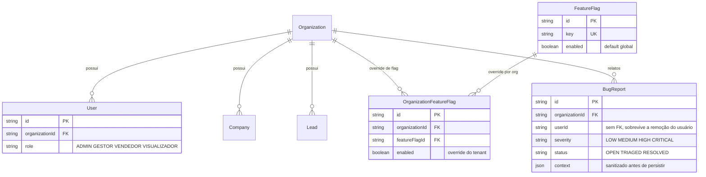

# Governança de 12 Requisitos de Arquitetura

**Escopo deste documento**: não é o PRD de uma funcionalidade de negócio nova. É a auditoria e o
framework de governança dos 12 requisitos de arquitetura/documentação/segurança exigidos para
qualquer sistema em produção, aplicados ao Prospector (Central de Inteligência Comercial
ATLASGR/Total Trac) como um todo — 10 dos 12 itens já existiam e são consolidados/documentados
aqui; 2 eram gaps reais e foram implementados nesta mudança (**Feature Flags** e **Módulo de
Reportar Problemas**).

Toda decisão de design deste documento e dos dois módulos novos segue `.claude/CLAUDE.md`
(constituição de design engineering deste repositório) e as skills operacionais em
`.claude/skills/`.

---

## 1. Documento do Sistema (PRD)

**Produto**: Prospector — Central de Inteligência Comercial, CRM B2B com IA (prospecção,
pipeline, roleplay de vendas, automações, analytics) para duas marcas irmãs (AtlasGR/Revenue OS e
Total Trac/Fleet OS — ver `docs/BrandConstitution.md`).

**Regra de negócio central que atravessa todo o sistema**: isolamento total de dados entre
organizações (tenants) — nenhuma linha de dado de uma organização é visível, editável ou
referenciável por outra, reforçado em duas camadas independentes (aplicação + banco, ver seção 4).

**Escopo desta mudança especificamente**: dois módulos horizontais, disponíveis a toda
organização, que não existiam antes:

- **Feature Flags** (`src/features/feature-flags/`) — permite ligar/desligar uma funcionalidade
  para uma organização específica em runtime, sem deploy.
- **Bug Reports** (`src/features/bug-reports/`) — permite que qualquer usuário relate um problema
  pela interface, com contexto técnico capturado automaticamente.

Fluxo funcional de cada um está descrito nas seções 7 e 8.

---

## 2. Mapa do Sistema (UML)

### 2.1 Componentes e borda de rede

```mermaid
flowchart LR
    subgraph Client["Navegador / App Android (Capacitor)"]
        UI[React 19 SPA]
    end

    UI -->|HTTPS| CF[Cloudflare<br/>DNS + CDN + WAF]
    CF -->|HTTPS Full strict| RENDER[Render<br/>Node/Express]

    subgraph RENDER_BOX["Processo Express (server.ts)"]
        HELMET[helmet + CORS whitelist]
        RATE[express-rate-limit<br/>api / ai / auth / bug-report]
        AUTHMW[authenticateToken<br/>Better Auth]
        TENANT[requireTenant<br/>injeta req.db tenant-scoped]
        ROLE[requireRole<br/>RBAC hierárquico]
        ROUTES[Rotas de feature<br/>src/features/*]
    end

    RENDER --> HELMET --> RATE --> AUTHMW --> TENANT --> ROLE --> ROUTES

    ROUTES --> PRISMA[Prisma Client<br/>extensão tenant-prisma.ts]
    PRISMA -->|"SET app.current_tenant_id"| PG[(Supabase Postgres<br/>RLS FORCE em toda tabela)]
    ROUTES --> REDIS[(Redis<br/>rate limit store + BullMQ)]

    style CF fill:#f7931a,color:#fff
    style PG fill:#3ecf8e,color:#052e2b
```

### 2.2 Entidade-relacionamento (núcleo de tenant + os 2 módulos novos)

Diagrama ilustrativo, não exaustivo — `prisma/schema.prisma` (≈1400 linhas, dezenas de models) é
a fonte de verdade completa.

---

## 3. Tabela de Regras de Acesso (RBAC)

**Fonte canônica**: `src/lib/auth/authorization.ts` — papel único hierárquico por usuário
(`User.role`), sem enum paralelo. Já existia um segundo sistema de permissões (18 papéis tipo
SUPER_ADMIN/SDR/CLOSER) nunca ligado a nenhuma rota; foi eliminado antes desta mudança (comentário
no topo do próprio arquivo) — **não recriar um terceiro sistema**.

| Papel | Nível | Descrição |
| --- | --- | --- |
| `ADMIN` | 100 | Acesso total à própria organização, inclusive configuração/segurança |
| `GESTOR` | 75 | Gestão comercial — vê e edita tudo, exceto administração da conta |
| `VENDEDOR` | 50 | Opera seu próprio pipeline — cria/edita, não apaga nem administra |
| `VISUALIZADOR` | 10 | Somente leitura + pode relatar problema |

`hasRequiredRole` compara por nível: satisfaz qualquer checagem cujo papel mínimo exigido seja
igual ou inferior ao do usuário. Matriz por módulo (levantada diretamente do código —
`grep -rn "requireRole(" src`, não de memória):

| Módulo / Rota | Leitura | Escrita | Exclusão / ação sensível |
| --- | --- | --- | --- |
| Companies / Contacts | todos autenticados do tenant | ADMIN, GESTOR, VENDEDOR | ADMIN, GESTOR |
| Leads / CRM 360 (mover estágio, converter) | todos | ADMIN, GESTOR, VENDEDOR | gestão: ADMIN, GESTOR |
| Activities | todos | ADMIN, GESTOR, VENDEDOR | ADMIN, GESTOR |
| Notes | todos | ADMIN, GESTOR, VENDEDOR | ADMIN, GESTOR |
| Knowledge (RAG) | todos | ADMIN, GESTOR, VENDEDOR | ADMIN, GESTOR |
| Prompts (override por tenant) | todos | — | ADMIN, GESTOR |
| Team (gestão de usuários) | ADMIN | ADMIN | ADMIN |
| LGPD (exclusão/exportação de titular) | todos (export) | — | ADMIN, GESTOR (erase) |
| Comercial Inteligente (executivo) | ADMIN, GESTOR | ADMIN, GESTOR | ADMIN, GESTOR |
| AI Settings (`/ai-settings`) | todos | ADMIN | ADMIN |
| Integrações (Bitrix/WhatsApp/3CX/Google) | todos | ADMIN, GESTOR, VENDEDOR (ações) | ADMIN, GESTOR (config) |
| **Feature Flags** (novo) | todos autenticados | — | **ADMIN** (override do próprio tenant) |
| **Bug Reports** (novo) | — | **todos autenticados** (criar relato) | **ADMIN, GESTOR** (listar/triagem) |

O desenho de RBAC dos dois módulos novos segue o mesmo raciocínio de menor privilégio já usado no
resto do sistema: quem pode *fazer* uma ação sensível (alterar comportamento de toda a
organização; ver relatos de outros usuários) é sempre ADMIN/GESTOR; quem só *usa* uma
funcionalidade (ler flags resolvidas; relatar um bug) é qualquer papel autenticado — inclusive
VISUALIZADOR, de propósito, no caso de Bug Reports (restringir quem pode relatar um problema seria
o oposto do objetivo do módulo).

---

## 4. Arquitetura Multi-tenant

Tenant = `Organization`. Isolamento em **duas camadas independentes**, já implementado e testado
antes desta mudança (`tests/integration/tenant-isolation-db001.test.ts`,
`organization-rls-bypass.test.ts`) — os dois módulos novos **reusam** essa fundação, não criam
isolamento próprio:

1. **Aplicação**: `src/lib/tenant-prisma.ts` — extensão do Prisma Client que injeta
   `organizationId` automaticamente em toda operação, para todo model que tenha essa coluna
   (calculado via DMMF do schema, não uma lista mantida à mão — um model novo sem
   `organizationId` nunca quebra silenciosamente por estar "esquecido" numa lista).
2. **Banco (RLS)**: toda tabela com dado de tenant tem `ENABLE` + `FORCE ROW LEVEL SECURITY` e uma
   `tenant_isolation_policy` que só libera a linha quando
   `current_setting('app.current_tenant_id') = organizationId`, setado por
   `src/lib/prisma.ts` a partir da sessão autenticada — ou quando `app.bypass_rls = 'on'`, restrito
   às rotas de bootstrap do Better Auth (login antes de haver tenant conhecido).

`FeatureFlag` (catálogo global, sem `organizationId` por desenho) segue o mesmo padrão já usado
para outra tabela global do schema (`AiEngineSetting`): a policy não isola por organização (não há
o que isolar), só exige que a conexão seja da própria app com tenant já resolvido — bloqueando
acesso direto via `anon`/`authenticated` do PostgREST do Supabase.

---

## 5. Travas no Banco de Dados

- Toda FK nova (`OrganizationFeatureFlag.organizationId/featureFlagId`, `BugReport.organizationId`)
  usa `ON DELETE CASCADE` — remover uma organização remove seus flags/relatos, não deixa órfão.
- `OrganizationFeatureFlag` tem `@@unique([organizationId, featureFlagId])` — impossível existir
  mais de um override para o mesmo flag na mesma organização por desenho de schema, não só por
  disciplina de aplicação.
- `FeatureFlag.key` é `@unique` — não há como o catálogo ter duas linhas para a mesma chave.
- Migration manual (`prisma/migrations/20260815030000_feature_flags_and_bug_reports/migration.sql`)
  segue o padrão já estabelecido nas migrations de RLS anteriores (`20260807100000_enable_rls_remaining_tables`
  etc.): `ENABLE` + `FORCE ROW LEVEL SECURITY` e `DROP POLICY IF EXISTS` + `CREATE POLICY`
  idempotentes em toda tabela nova.
- 48+ migrations já existentes cobrem o restante do schema (~1400 linhas, dezenas de models) —
  este documento não repete essa cobertura, só confirma que o padrão foi seguido nas tabelas novas.

---

## 6. Proibição de Senhas/Segredos no Código

Já era um requisito cumprido antes desta mudança — nada de novo introduzido aqui quebra o padrão:

- `.env.example` documentado (`BUG_REPORT_RATE_LIMIT_MAX` adicionado nesta mudança, seguindo o
  mesmo padrão de `AUTH_RATE_LIMIT_MAX`/`AI_RATE_LIMIT_MAX`).
- `src/config/env.ts` valida todo env var com Zod, fail-fast no boot (sem default perigoso).
- Segredos de integração (tokens OAuth, webhooks) são cifrados em repouso com AES-256-GCM
  (`src/lib/crypto/secretFields.ts`), chave própria (`CREDENTIALS_ENCRYPTION_KEY`), separada do
  segredo de sessão.
- CI roda **gitleaks** em todo push/PR (`.github/workflows/ci.yml`).
- **Gap conhecido, não resolvido nesta mudança** (fora de escopo, já documentado em
  `docs/compliance/COMPLIANCE_MATRIX.md`): não há Secrets Manager/Vault dedicado — a gestão é
  env vars no provedor (Render, `sync: false`) + a criptografia de campo acima. Nenhum dos dois
  módulos novos introduz um segredo próprio; `BugReport.context` é sanitizado especificamente
  para reduzir o risco de um segredo de terceiro acabar persistido ali por acidente (ver seção 8).

---

## 7. Feature Flags (módulo novo)

**Problema que resolve**: antes desta mudança, o único jeito de ligar/desligar uma funcionalidade
por organização era uma variável de ambiente + allowlist de `organizationId` hardcoded no código
(ex.: `SDR_COLD_CALL_ENABLED`/`SDR_COLD_CALL_ORGANIZATIONS` em `src/config/env.ts`) — qualquer
mudança exige deploy. Esse padrão continua existindo e servindo bem para flags que precisam de
redeploy de qualquer forma; o sistema novo cobre o caso que faltava: um ADMIN ligando/desligando
algo em runtime, pela própria interface.

**Desenho**:
- Catálogo de chaves conhecidas declarado em código (`src/features/feature-flags/featureFlags.registry.ts`,
  revisado em PR) — sincronizado com a tabela `FeatureFlag` a cada boot do servidor
  (`featureFlagsService.syncRegistry()`, idempotente). Uma organização **não pode criar uma chave
  nova livremente via API** — só o catálogo definido em código existe.
- Um ADMIN só pode ligar/desligar o **override da própria organização**
  (`OrganizationFeatureFlag`) — nunca o default global do catálogo. Isso evita que um ADMIN de uma
  organização mude o comportamento de todas as outras.
- Resolução: override da organização se existir, senão o default global (`isEnabled(key, orgId)`
  em `featureFlags.service.ts`) — chave desconhecida resolve para `false` (fail-closed).
- API: `GET /api/feature-flags` (qualquer papel, lista resolvida), `PUT`/`DELETE /api/feature-flags/:key`
  (só ADMIN).
- Frontend: `useFeatureFlag(key, fallback)` (`src/hooks/useFeatureFlags.ts`, cache in-memory
  compartilhado, sem dependência nova) e um painel de administração em Configurações
  (`src/features/feature-flags/components/FeatureFlagsPanel.tsx`, visível só para `isAdmin`).

---

## 8. Módulo de Reportar Problemas (módulo novo)

**Problema que resolve**: antes desta mudança não existia nenhum jeito, pela interface, de um
usuário relatar um problema — só um `ErrorBoundary` genérico (mostra stack na tela) e logging
interno (`src/lib/logger.ts` no backend, `src/lib/clientLogger.ts` no navegador), sem nenhum
serviço de error tracking (Sentry etc., que este projeto conscientemente não usa — ver
`performance/SKILL.md` sobre não adicionar dependência sem necessidade real).

**Desenho**:
- Botão flutuante global (`src/components/ui/BugReportButton.tsx`), montado em `MainLayout.tsx`
  (canto inferior esquerdo, para não colidir com `AtlasChatbotTrigger`/`VoiceCommandWidget` no
  canto direito), visível para todo usuário autenticado — controlado pelo próprio sistema de
  feature flags acima (`bug_report_module`, default ligado).
- Captura automática de contexto no momento do envio: URL, rota, marca ativa, user agent,
  viewport, e as últimas 30 entradas `warn`/`error` do `clientLogger` (ring buffer adicionado a
  `src/lib/clientLogger.ts` só para esse fim — `debug`/`info` não entram, são ruído).
- **Sanitização antes de persistir** (`src/features/bug-reports/bugReport.sanitize.ts`): redige
  padrões de segredo comuns (Bearer token, JWT, chave `sk-...`, campos `password`/`token`/`apiKey`)
  tanto na descrição quanto nos logs anexados, e limita tamanho (título 200, descrição 5000, até
  20 entradas de log de até 500 caracteres cada) — reduz o risco de um erro de terceiro vazar um
  segredo para dentro de `BugReport.context` sem impedir o relato de ser útil.
- RBAC: qualquer papel autenticado cria (`POST /api/bug-reports`, sem `requireRole` de propósito);
  só ADMIN/GESTOR lista (`GET`) e triagem (`PATCH /:id/status`) — RLS multi-tenant garante que
  ninguém vê relato de outra organização, nem por engano de rota.
- Rate limit dedicado por organização (`BUG_REPORT_RATE_LIMIT_MAX`, default 10/15min) — mesmo
  raciocínio do `aiLimiter` (SEC-008b): por tenant, não por IP, para não punir um escritório
  inteiro atrás do mesmo NAT pelo excesso de uma única organização.

---

## 9. Testes Automáticos

Estrutura já robusta antes desta mudança (Vitest unit/integration/container + Playwright e2e + k6
load — `tests/`), estendida para os dois módulos novos:

- `tests/unit/features/bug-reports/bugReport.sanitize.test.ts` — 12 casos (redação de
  Bearer/JWT/chave/campo sensível, truncamento, filtragem de entrada malformada). **Executado e
  passando** nesta mudança.
- `tests/unit/features/feature-flags/featureFlags.service.test.ts` — 7 casos (fail-closed em chave
  desconhecida, precedência override > default, isolamento entre organizações na escrita).
  **Executado e passando** nesta mudança.
- `tests/integration/rbac-e2e-feature-flags.test.ts` e `rbac-e2e-bug-reports.test.ts` — mesmo
  padrão de `rbac-e2e-crm-operations.test.ts` (sessão real via Better Auth + RLS real do
  Postgres): RBAC por papel, isolamento de tenant na leitura/escrita, e — no caso de bug reports —
  confirma que o texto sensível é redigido no banco, não só na resposta HTTP. **Escritos seguindo
  o padrão do repositório, mas não executados nesta sessão**: o ambiente de execução usado para
  esta mudança não tem Postgres local disponível (sem daemon Docker); rodam normalmente no CI
  (`.github/workflows/ci.yml`, que sobe Postgres real) e via `npm run test:integration` com
  `.env.test` configurado. Ver seção "Follow-ups" abaixo.

---

## 10. Auditoria de Segurança (Pentest)

Processo já existente, não recriado:

- **CI (todo PR)**: gitleaks (segredo versionado), `npm audit --audit-level=high` (com
  `continue-on-error`, risco aceito e documentado em `docs/ADR/ADR-001-BetterAuth-Vulnerability.md`),
  lint, typecheck, testes unit/integration/e2e.
- **Agendado**: Trivy semanal (dependências + filesystem), SonarQube em push/PR.
- **Manual, pré-produção**: ZAP contra staging (`docs/deploy/RELEASE_CHECKLIST.md`), relatórios de
  pentest já produzidos em `docs/reports/PENTEST_REPORT.md`.
- **Gap de frescor documental, não de processo** (fora de escopo desta mudança, registrado aqui
  para rastreabilidade): `docs/security/SECURITY_GUIDE.md` e `docs/security/THREAT_MODEL.md` ainda
  descrevem um fluxo de auth com JWT/refresh cookie que não é mais real — a stack atual é Better
  Auth (`src/lib/auth.ts`). Recomenda-se uma atualização desses dois documentos como item
  separado, não misturado com a entrega de Feature Flags/Bug Reports.

---

## 11. Proteção de Borda (WAF / Rate Limiting)

- **WAF**: Cloudflare na frente do Render (`docs/deploy/producao.md`) — infraestrutura, não código
  deste repositório.
- **Rate limiting de aplicação**, `server.ts`, todos com `RedisStore` em produção:
  - `apiLimiter` — geral, `API_RATE_LIMIT_MAX` (default 600/15min) por IP.
  - `aiLimiter` — rotas de IA/conhecimento, `AI_RATE_LIMIT_MAX` (default 30/15min) por
    organização.
  - `authLimiter` — `/api/auth`, `AUTH_RATE_LIMIT_MAX` (default 20/15min) por IP.
  - **`bugReportLimiter`** (novo) — `/api/bug-reports`, `BUG_REPORT_RATE_LIMIT_MAX` (default
    10/15min) por organização.
- `/api/feature-flags` não tem limiter dedicado — cai no `apiLimiter` genérico, que já é
  suficiente para uma rota de baixo volume de escrita (só ADMIN, só ao configurar).

---

## 12. Criptografia / HTTPS

- TLS terminado no Cloudflare (modo **Full strict**) → Render, que serve HTTPS nativo
  (`docs/deploy/producao.md`, seção 3) — nenhuma rota nova desta mudança expõe HTTP.
- Dados sensíveis em repouso: credenciais de integração cifradas com AES-256-GCM (seção 6). Os
  dois módulos novos não introduzem PII adicional nem credencial nova — `BugReport.context` é
  ativamente sanitizado (seção 8) exatamente para não se tornar um novo lugar onde um segredo
  poderia acabar persistido em texto claro.
- Em trânsito dentro da própria infraestrutura (Render → Supabase Postgres): conexão TLS do
  Prisma/pg, já configurada antes desta mudança.

---

## Resumo de status

| # | Requisito | Status | Onde |
| --- | --- | --- | --- |
| 1 | PRD | ✅ Consolidado neste documento | seção 1 |
| 2 | UML (componentes + ER) | ✅ Novo, neste documento | seção 2 |
| 3 | Matriz RBAC | ✅ Levantada do código real, neste documento | seção 3 |
| 4 | Multi-tenant | ✅ Já implementado, reusado pelos módulos novos | `src/lib/tenant-prisma.ts` |
| 5 | Travas de banco / RLS | ✅ Já implementado + estendido | migration `20260815030000_*` |
| 6 | Sem segredo no código | ✅ Já implementado; gap de Vault conhecido e aceito | `src/config/env.ts` |
| 7 | Feature Flags | ✅ **Novo nesta mudança** | `src/features/feature-flags/` |
| 8 | Reportar Problemas | ✅ **Novo nesta mudança** | `src/features/bug-reports/` |
| 9 | Testes automáticos | ✅ Unit + integração + e2e/acessibilidade verdes no CI (PR #127) | `tests/unit/`, `tests/integration/`, `.github/workflows/ci.yml` |
| 10 | Auditoria de segurança/pentest | ✅ Processo já existe; docs de segurança corrigidos nesta mudança | `.github/workflows/ci.yml`, `docs/security/` |
| 11 | WAF / Rate limiting | ✅ Já implementado + limiter dedicado novo | `server.ts` |
| 12 | HTTPS / Criptografia | ✅ Já implementado; `BugReport.context` sanitizado | `docs/deploy/producao.md` |

## Follow-ups — status

1. ✅ **Resolvido.** `npm run test:integration` rodou no CI (`build-and-test`, PR #127) com
   Postgres real — `rbac-e2e-feature-flags.test.ts` e `rbac-e2e-bug-reports.test.ts` passaram.
   O próprio CI encontrou e permitiu corrigir dois bugs reais que só apareciam com banco real:
   `featureFlagsService.syncRegistry()` rodando sem `bypassRls` no boot (RLS bloqueava o
   catálogo de flags de ser semeado — ver seção 4) e um teste que assumia incorretamente que
   dois usuários de `signUpRealUser` compartilhavam organização.
2. ✅ **Resolvido.** `docs/security/SECURITY_GUIDE.md` e `docs/security/THREAT_MODEL.md`
   atualizados para refletir a stack real: sessão via Better Auth (cookie `HttpOnly`, não par de
   JWT access/refresh), RBAC canônico de 4 papéis (`src/lib/auth/authorization.ts`), e a seção
   "Replay Attacks" do threat model — que descrevia um cache de nonce que nunca existiu neste
   código — corrigida para registrar isso como gap real e não mitigado, em vez de uma proteção
   fictícia.
3. **Avaliação de Secrets Manager dedicado** — decisão tomada: **Infisical**, via sync nativo
   Infisical → Render (sem mudança de código). Runbook completo de migração, incluindo a ordem
   segura de troca de cada segredo e o cuidado especial com `BETTER_AUTH_SECRET`/
   `CREDENTIALS_ENCRYPTION_KEY`, em `docs/security/SECRETS_MANAGER_MIGRATION.md`. A criação de
   conta/projeto no Infisical e a importação dos segredos reais depende de acesso que só o time
   do produto tem — não implementado nesta mudança, mas não é mais uma avaliação em aberto.
   - **Estado atual**: segredos vivem em env vars por provedor (Render, `sync: false`) + Zod
     fail-fast (`src/config/env.ts`) + criptografia de campo AES-256-GCM para credenciais de
     integração persistidas no banco (`src/lib/crypto/secretFields.ts`). Cobre rotação manual e
     não-commit (gitleaks no CI), mas não cobre: rotação automática, auditoria de acesso a
     segredo individual, nem short-lived credentials.
   - **Opções avaliadas**:
     - *HashiCorp Vault* — mais completo (dynamic secrets, leasing), mas exige operar um
       serviço adicional com HA própria; desproporcional ao tamanho atual da equipe/infra
       (Render + Supabase, sem Kubernetes).
     - *AWS Secrets Manager / GCP Secret Manager* — só faz sentido se a infra migrar para esse
       provedor de nuvem; hoje o deploy é Render, que não integra nativamente com nenhum dos
       dois sem trabalho extra de rede/IAM.
     - *Doppler / Infisical* — SaaS gerenciado, menor custo operacional, integra com Render via
       env var sync ou CLI no build; mais próximo do modelo atual (env var), com rotação e
       auditoria de acesso como cima.
   - **Decisão**: Infisical (menor custo de adoção sobre a infra atual do que Vault) — ver
     runbook em `docs/security/SECRETS_MANAGER_MIGRATION.md`. Até a migração ser concluída,
     continua sendo um risco aceito e documentado, não um bloqueador de produção: nenhum segredo
     real está commitado (gitleaks confirma isso a cada PR) e a superfície de segredo real é
     pequena (poucas integrações por organização).
