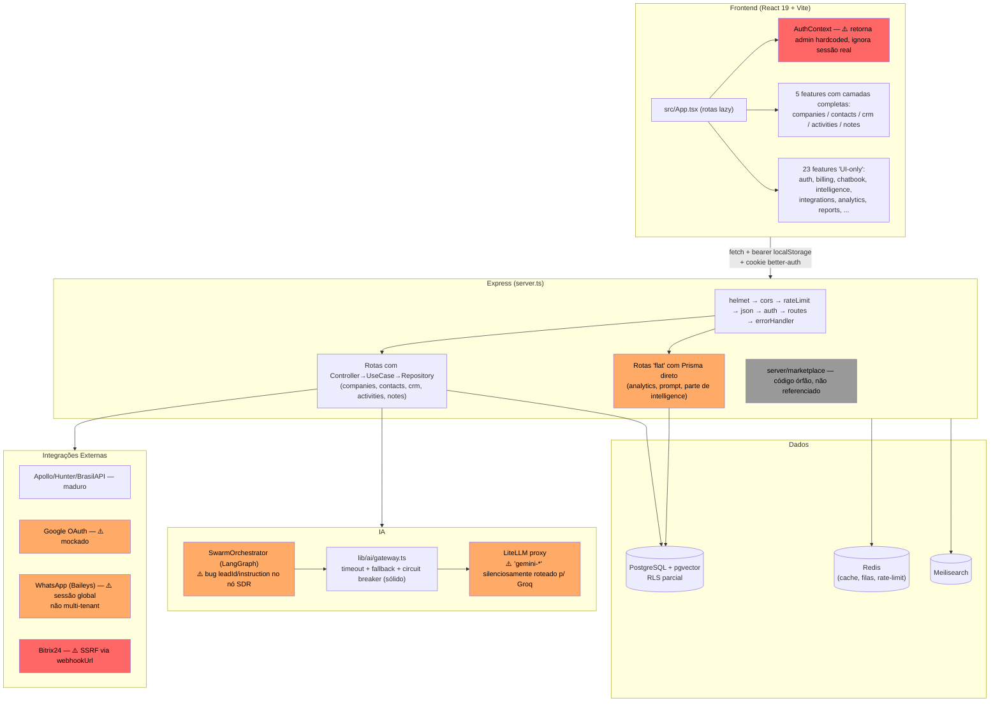
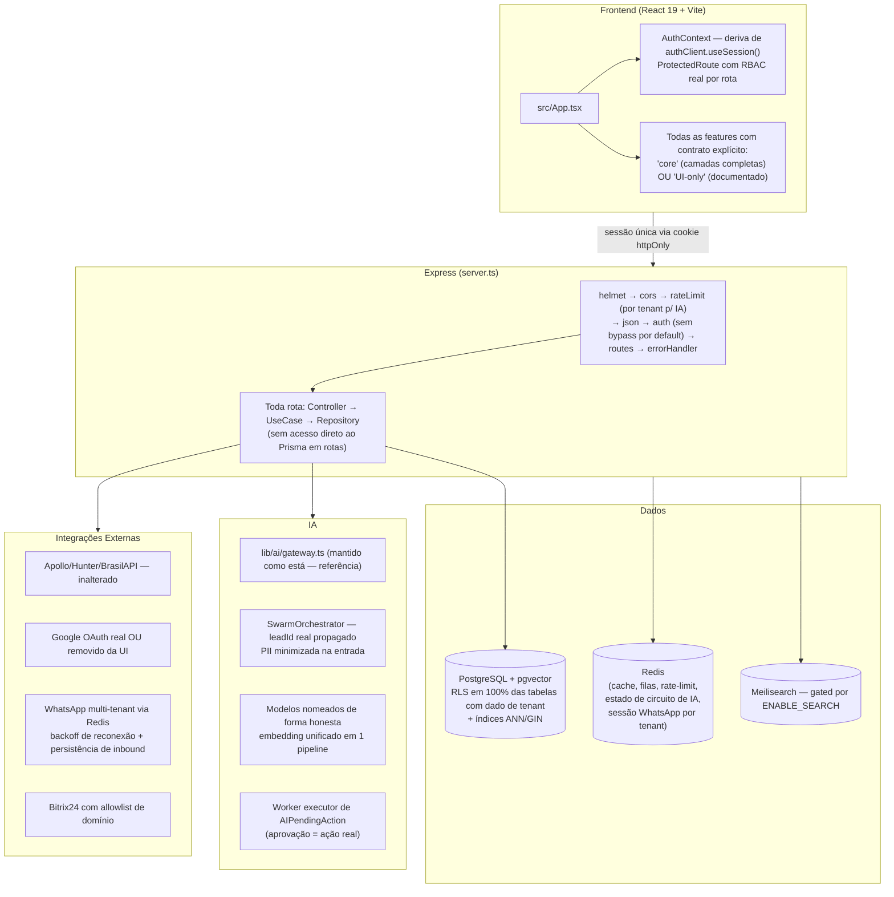

# Arquitetura Atual e Alvo

## Arquitetura Atual

**Leitura do diagrama:** em vermelho, os pontos que representam falha de controle de acesso confirmada (autenticação de fato desabilitada, SSRF); em laranja, débitos funcionais relevantes mas não críticos de acesso (integrações mockadas/frágeis, bug de IA, roteamento de modelo enganoso, rotas que pulam a camada de serviço); em cinza, código órfão sem efeito em produção.

---

## Arquitetura Alvo

**Principais mudanças estruturais:**
1. Um único mecanismo de sessão (cookie httpOnly do better-auth), eliminando o token duplicado em `localStorage`.
2. RBAC real aplicado por rota/feature, não apenas um `ProtectedRoute` genérico.
3. 100% das rotas passam por Controller→UseCase→Repository — nenhuma rota toca Prisma diretamente.
4. Estado que hoje é em memória de processo (circuito de IA, sessão WhatsApp) migra para Redis, viabilizando múltiplas réplicas.
5. RLS cobre todas as tabelas com coluna de tenant, incluindo as de IA/conhecimento.
6. `AIPendingAction` aprovado dispara ação real via worker dedicado.
