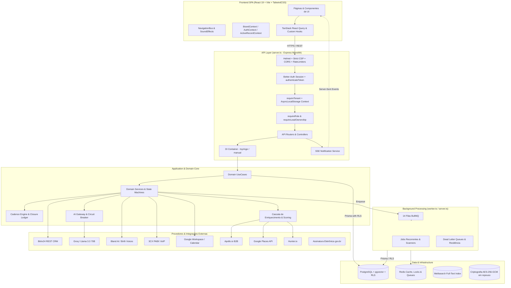
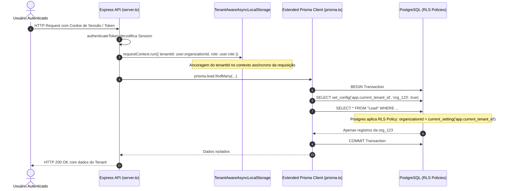
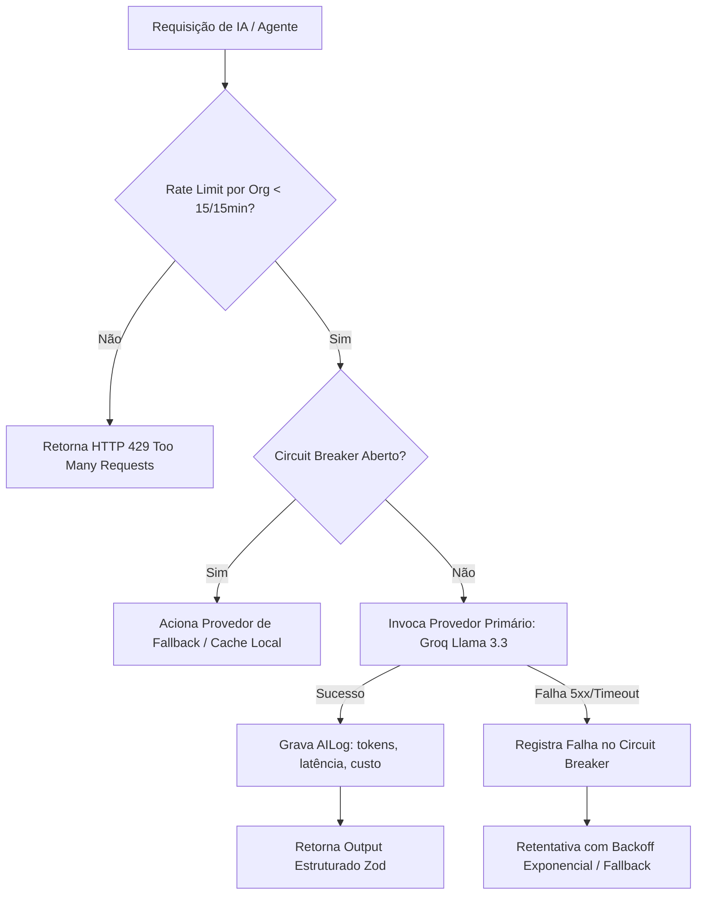

# ARQUITETURA ATUAL — CENTRAL DE INTELIGÊNCIA COMERCIAL ATLAS GR

**Data:** 16 de Agosto de 2026  
**Auditor:** Principal Software Architect & Staff Engineer  

---

## 1. Visão Geral da Arquitetura

A **Central de Inteligência Comercial ATLAS GR** é estruturada como uma aplicação moderna orientada a domínios (Domain-Driven Design / Clean Architecture parcial), composta por um frontend SPA React 19 desacoplado e servido por uma API REST Express em Node.js com suporte a processamento assíncrono via BullMQ/Redis e persistência multi-tenant isolada no PostgreSQL via Prisma e Row-Level Security (RLS).

---

## 2. Camada de Segurança e Multi-Tenancy (Row-Level Security)

### Isolamento Físico e Lógico por Organização

A plataforma implementa **Row-Level Security (RLS) no PostgreSQL**, garantindo que nenhum vazamento cross-tenant ocorra mesmo se uma cláusula `where: { organizationId }` for omitida no código da aplicação.

### Criptografia de Dados Sensíveis em Repouso
- **Campos Criptografados:** Telefones pessoais de contatos (`Contact.phone`), Webhook URLs e credenciais de PABX (`ThreeCXConnection.apiSecret`, `BitrixConnection.webhookUrl`).
- **Algoritmo:** AES-256-GCM com chave simétrica de 32 bytes gerada via `CREDENTIALS_ENCRYPTION_KEY` e vetor de inicialização (IV) aleatório por registro.
- **Fail-Closed:** Se a chave não for válida ou estiver ausente, a aplicação encerra no boot (`process.exit(1)`).

---

## 3. Arquitetura do Gateway de IA e Automações

O módulo de IA utiliza uma arquitetura resiliente com **Circuit Breaker** distribuído no Redis (com degradação limpa em memória caso o Redis esteja indisponível), rate limiting por organização e auditoria de tokens/custos.

---

## 4. Arquitetura de Cadência e Autonomia Comercial (Onda 10)

Implementado com foco em **Autonomia 24/7 com Fechamento Determinístico**:

1. **Máquina de Estados de Cadência:** Sequências de toques multicanais (E-mail, WhatsApp, Ligação).
2. **Reply Tracking:** Identificação de respostas genuínas via `Message-Id` e `In-Reply-To`.
3. **Agendamento Verificável:** Transição para reunião agendada só ocorre mediante evidência inequívoca (`LeadCalendarReply`, `LeadSchedulingLinkClick`, `ManualVerified`).
4. **Fechamento Determinístico:** Transição para `Negócios Ganhos` é **impossível via IA** — exige assinatura no Gov.br (`SignatureCompleted`), confirmação de pagamento (`PaymentConfirmed`) ou validação manual de gestor (`ManualCrmConfirmation`) registrada no `DealClosureEvent`.

---

## 5. Arquitetura de Filas e Processamento Assíncrono

A plataforma opera com um modelo híbrido:
- **`server.ts`**: Processo HTTP principal. Enfileira jobs em 14 filas BullMQ.
- **`worker.ts`**: Entrypoint dedicado de processamento. Consome as filas isoladamente com health check independente na porta 3006 e métricas Prometheus expostas.
- **Transição de Governança (Handoff 16-00):** Eliminação da instanciação redundante de workers dentro do `server.ts` para evitar concorrência desnecessária quando `worker.ts` estiver ativo em ambiente de produção.
