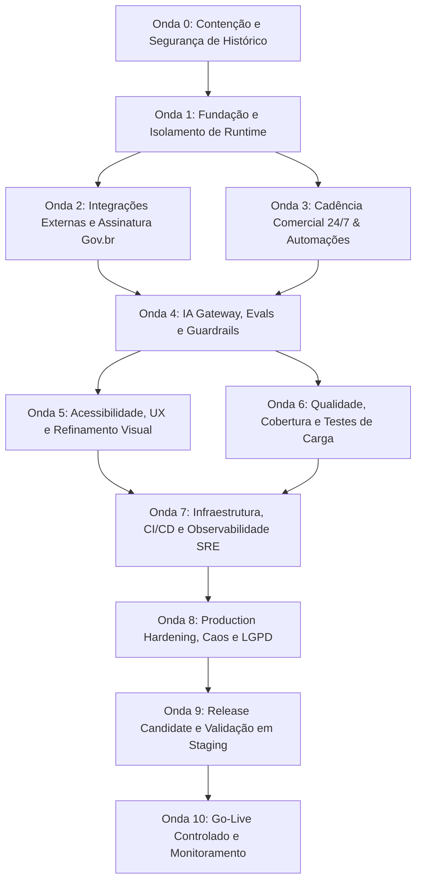

# PLANO MESTRE DE FINALIZAÇÃO — CENTRAL DE INTELIGÊNCIA COMERCIAL ATLAS GR

**Data:** 16 de Agosto de 2026  
**Auditor:** Principal Software Architect, Staff Engineer & Release Lead  

---

## 1. Visão Geral do Plano de Ondas

O Plano Mestre de Finalização estabelece a sequência exata de intervenções técnicas necessárias para levar a plataforma da sua maturidade atual (Production Candidate com ressalvas) até a prontidão plena para operação corporativa de missão crítica (**Enterprise Ready**).

---

## 2. Detalhamento das Ondas de Finalização

### Onda 0 — Contenção e Segurança
- **Objetivo:** Eliminar riscos críticos de segurança no histórico e rotação de credenciais nos provedores.
- **Itens:**
  1. Higienização do histórico Git com remoção de `backups/*.dump` via `git filter-repo`.
  2. Rotação manual de credenciais e webhooks nos painéis da Bland AI e Bitrix24.
  3. Validação de ausência de segredos em todas as branches via Gitleaks.
- **Arquivos:** `backups/`, `.env.example`, `.github/workflows/security.yml`.
- **Riscos:** Reescrita de hashes Git exige coordenação da equipe.
- **Testes:** `git log --all -- backups/` vazio; scanner Gitleaks limpo.
- **Critério de Entrada:** Aprovação humana da reescrita de histórico.
- **Critério de Saída:** Repositório sem resíduos de dados sensíveis; novas chaves em produção.
- **Paralelização:** Execução isolada pré-ondas.

---

### Onda 1 — Fundação Técnica e Desacoplamento de Runtime
- **Objetivo:** Separar completamente o ciclo de vida do servidor HTTP (`server.ts`) do worker de filas (`worker.ts`).
- **Itens:**
  1. Aplicar a remoção da instanciação de workers de `server.ts` (Handoff 16-00).
  2. Configurar o graceful shutdown independente em ambos os processos.
  3. Atualizar configurações de deploy para subir dois serviços distintos.
- **Arquivos:** `server.ts`, `worker.ts`, `render.yaml`, `Dockerfile`.
- **Riscos:** Instâncias locais sem Redis rodando precisam de fallback explícito para desenvolvimento.
- **Testes:** Smoke tests de `server.ts` (HTTP 200) e `worker.ts` (14 filas registradas, porta 3006).
- **Critério de Entrada:** Onda 0 concluída.
- **Critério de Saída:** Processo web sem conexões com workers; worker processando filas de forma isolada.
- **Paralelização:** Especialista 01 (Dados/Backend) + 08 (DevOps).

---

### Onda 2 — Integrações Externas e Assinatura Digital Gov.br
- **Objetivo:** Conectar a assinatura de propostas à API oficial do Gov.br e estabilizar webhooks.
- **Itens:**
  1. Implementar `GovBrSignatureAdapter` para envio e consulta de status de assinaturas.
  2. Conectar o webhook do Gov.br ao ledger de `DealClosureEvent`.
  3. Refatorar o cliente de conexão WhatsApp (Baileys) com reconexão resiliente.
- **Arquivos:** `src/features/cadence/infra/GovBrSignatureAdapter.ts`, `src/features/integrations/whatsapp/`.
- **Riscos:** Dependência de credenciamento no ambiente de homologação do Governo Federal.
- **Testes:** Testes unitários com mocks de resposta Gov.br; testes de webhook com HMAC.
- **Critério de Entrada:** Onda 1 aprovada.
- **Critério de Saída:** Proposta assinada dispara automaticamente transição determinística para Ganho.
- **Paralelização:** Especialista 06 (Integrações) + Especialista 17 (Cadência).

---

### Onda 3 — Cadência Comercial 24/7 e Inbound Reply Tracking
- **Objetivo:** Conectar o rastreamento de respostas de e-mail ao motor de cadência e cron de toques.
- **Itens:**
  1. Implementar parser de webhook/IMAP para e-mails recebidos com identificação de `In-Reply-To`.
  2. Acoplar o motor de detecção de respostas genuínas (`isGenuineLeadReply`) ao agendamento de reuniões.
  3. Configurar cron de disparos de cadência respeitando janelas de horário comercial.
- **Arquivos:** `src/features/cadence/services/`, `src/features/prospecting/services/email.service.ts`.
- **Riscos:** E-mails de auto-resposta (out-of-office) serem interpretados como resposta genuína (mitigado por heurísticas de header).
- **Testes:** Suíte de testes unitários do `replyTracking.test.ts` e simulação de concorrência.
- **Critério de Entrada:** Onda 1 aprovada.
- **Critério de Saída:** Resposta do lead interrompe automaticamente a sequência de disparos frios.
- **Paralelização:** Especialista 05 (Prospecção) + Especialista 17 (Cadência).

---

### Onda 4 — IA Gateway, Evals e Guardrails Corporativos
- **Objetivo:** Elevar o gateway de IA com monitoramento de alucinações, governança de custo e fallback.
- **Itens:**
  1. Habilitar persistência resiliente de `AILog` em filas assíncronas para não bloquear rotas síncronas.
  2. Implementar pipeline de avaliação contínua de prompts com métricas de aderência.
  3. Configurar teto orçamentário rígido por tenant com bloqueio automático ao atingir 100% da cota.
- **Arquivos:** `src/lib/ai/gateway.ts`, `src/features/intelligence/services/guardrails.service.ts`.
- **Riscos:** Falha de provedor externo (Groq/OpenAI) causar degradação.
- **Testes:** Testes de circuit breaker com Redis mockado; `verify:ai` com 100% de sucesso.
- **Critério de Entrada:** Onda 1 aprovada.
- **Critério de Saída:** Rastreamento de tokens/custo 100% auditável por organização sem falha de persistência.
- **Paralelização:** Especialista 07 (IA) + Especialista 13 (Governança).

---

### Onda 5 — Acessibilidade, Design System e Paridade Mobile
- **Objetivo:** Zerar warnings de lint, implementar Command Palette e validar Deep Linking.
- **Itens:**
  1. Resolver os 73 warnings restantes de acessibilidade (`jsx-a11y`) e tipagens `any`.
  2. Implementar a Command Palette universal (`⌘K`).
  3. Publicar o `assetlinks.json` para validação de links nativos no app Android/iOS.
- **Arquivos:** `src/components/`, `src/features/intelligence/components/`, `src/pages/`, `android/`.
- **Riscos:** Regressões visuais em componentes ricos.
- **Testes:** `npm run lint` resultando em 0 warnings; testes E2E de teclado com axe-core.
- **Critério de Entrada:** Onda 4 aprovada.
- **Critério de Saída:** 0 erros e 0 warnings no Linter; acessibilidade WCAG AA comprovada.
- **Paralelização:** Especialista 02 (UX) + Especialista 03 (Design/A11y) + Especialista 09 (Mobile).

---

### Onda 6 — Qualidade, Cobertura e Testes de Carga
- **Objetivo:** Blindar a suíte de testes com testes de carga (k6) e resolver flakes no CI.
- **Itens:**
  1. Executar testes de carga com k6 simulando 500 usuários simultâneos no CRM e Kanban.
  2. Regenerar snapshots do Playwright no ambiente Linux do CI para reativar os 5 testes skipados.
  3. Aumentar a cobertura de testes de integração dos workers e filas assíncronas.
- **Arquivos:** `tests/`, `playwright.config.ts`, `scripts/test/`.
- **Riscos:** Gargalos de concorrência em queries do PostgreSQL identificados sob carga.
- **Testes:** `npm run test:unit`, `test:integration`, `test:e2e` rodando 100% verdes sem skips.
- **Critério de Entrada:** Ondas 2, 3, 4 e 5 concluídas.
- **Critério de Saída:** P95 de resposta da API < 200ms sob 500 VUs; 0 testes falhando ou pulados.
- **Paralelização:** Especialista 08 (QA Lead) + Especialista 14 (Harness).

---

### Onda 7 — Infraestrutura, CI/CD e Observabilidade SRE
- **Objetivo:** Estabelecer infraestrutura de monitoramento com Prometheus, Grafana e alertas ativos.
- **Itens:**
  1. Unificar a coleta de métricas HTTP no Express via histograma `http_request_duration_seconds`.
  2. Configurar dashboards Grafana para monitoramento do PostgreSQL (conexões/pool), Redis e BullMQ.
  3. Conectar Alertmanager para disparo de alertas críticos em canais de operação.
- **Arquivos:** `src/shared/middlewares/observability.ts`, `charts/`, `k8s/`, `infrastructure/`.
- **Riscos:** Sobrecarga de scraping de métricas em alta concorrência.
- **Testes:** Simulação de erro 5xx gerando notificação automática no Alertmanager.
- **Critério de Entrada:** Onda 6 aprovada.
- **Critério de Saída:** "Se algo quebrar às 03:00, o alerta dispara automaticamente e identifica a causa".
- **Paralelização:** Especialista 10 (Infra/SRE).

---

### Onda 8 — Production Hardening, Caos e Conformidade LGPD
- **Objetivo:** Validar resiliência a falhas de infraestrutura e conformidade regulatória rigorosa.
- **Itens:**
  1. Testes de caos: queda forçada do Redis e recuperação limpa sem perda de requisições síncronas.
  2. Testes de failover do PostgreSQL e validação do backup diário com restore automatizado.
  3. Auditoria de ponta a ponta do fluxo de exclusão/anonimização de dados LGPD.
- **Arquivos:** `src/lib/queue/redis.ts`, `src/features/lgpd/`, `scripts/db/`.
- **Riscos:** Bloqueio indevido de conexões durante failover.
- **Testes:** Script de teste de restore de backup executado com validação de integridade referencial.
- **Critério de Entrada:** Onda 7 aprovada.
- **Critério de Saída:** Zero perda de dados em falha de nó de cache; conformidade LGPD aprovada.
- **Paralelização:** Especialista 01 (Segurança/Dados) + Especialista 08 (QA).

---

### Onda 9 — Release Candidate e Homologação Completa
- **Objetivo:** Execução de todas as jornadas de negócio em ambiente de Staging com dados sanitizados.
- **Itens:**
  1. Validação da jornada completa: Entrada de Lead -> Enriquecimento -> Cadência -> Agendamento -> Proposta -> Assinatura -> Fechamento -> Sync Bitrix.
  2. Verificação do checklist master de produção com todos os gates verdes.
  3. Congelamento de código (Code Freeze) para a versão `1.0.0-RELEASE-APPROVED`.
- **Arquivos:** Todos os módulos do repositório.
- **Riscos:** Descoberta de corner-case de regra de negócio no ambiente integrado.
- **Testes:** Bateria completa de testes automatizados e manuais executados contra Staging.
- **Critério de Entrada:** Todas as Ondas de 0 a 8 aprovadas.
- **Critério de Saída:** Tag de release criada; 0 bugs P0 e P1 em aberto.
- **Paralelização:** Coordenador 00 + Especialista 08 (QA Lead).

---

### Onda 10 — Go-Live e Operação Assistida
- **Objetivo:** Deploy controlado em produção, validação de smoke tests e início do monitoramento 24/7.
- **Itens:**
  1. Execução de migrações no PostgreSQL de produção via Job seguro.
  2. Deploy das imagens Docker de API e Worker.
  3. Execução de `npm run verify:prod` para validação de saúde de runtime.
  4. Acompanhamento de telemetria durante as primeiras 72 horas de operação.
- **Arquivos:** `render.yaml`, `Dockerfile`, `scripts/verify-prod.ts`.
- **Riscos:** Latência inicial de aquecimento de conexões (pool warmup).
- **Testes:** Smoke tests de produção passando em < 1 segundo; zero erros 5xx na inicialização.
- **Critério de Entrada:** Onda 9 aprovada com assinatura formal de Release.
- **Critério de Saída:** Plataforma operando em produção com status **Enterprise Ready**.
- **Paralelização:** Equipe completa em plantão de release.
